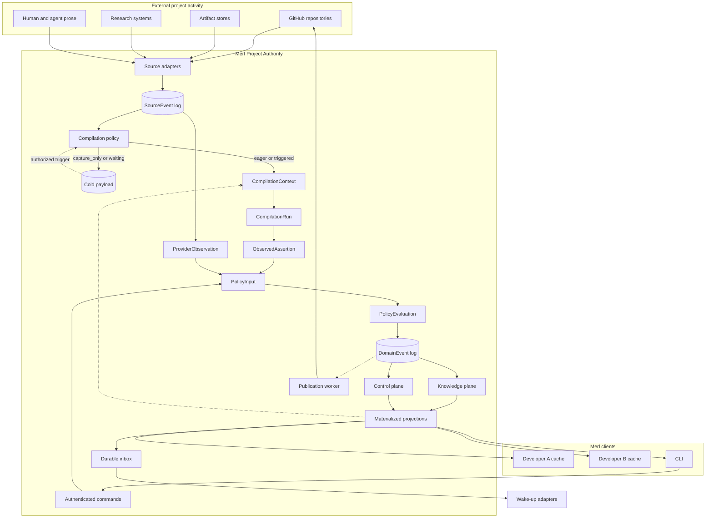
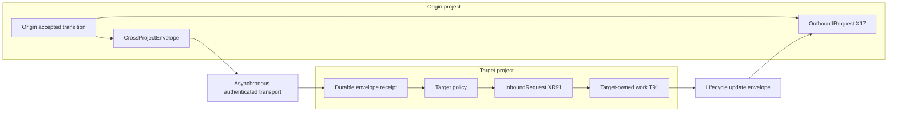
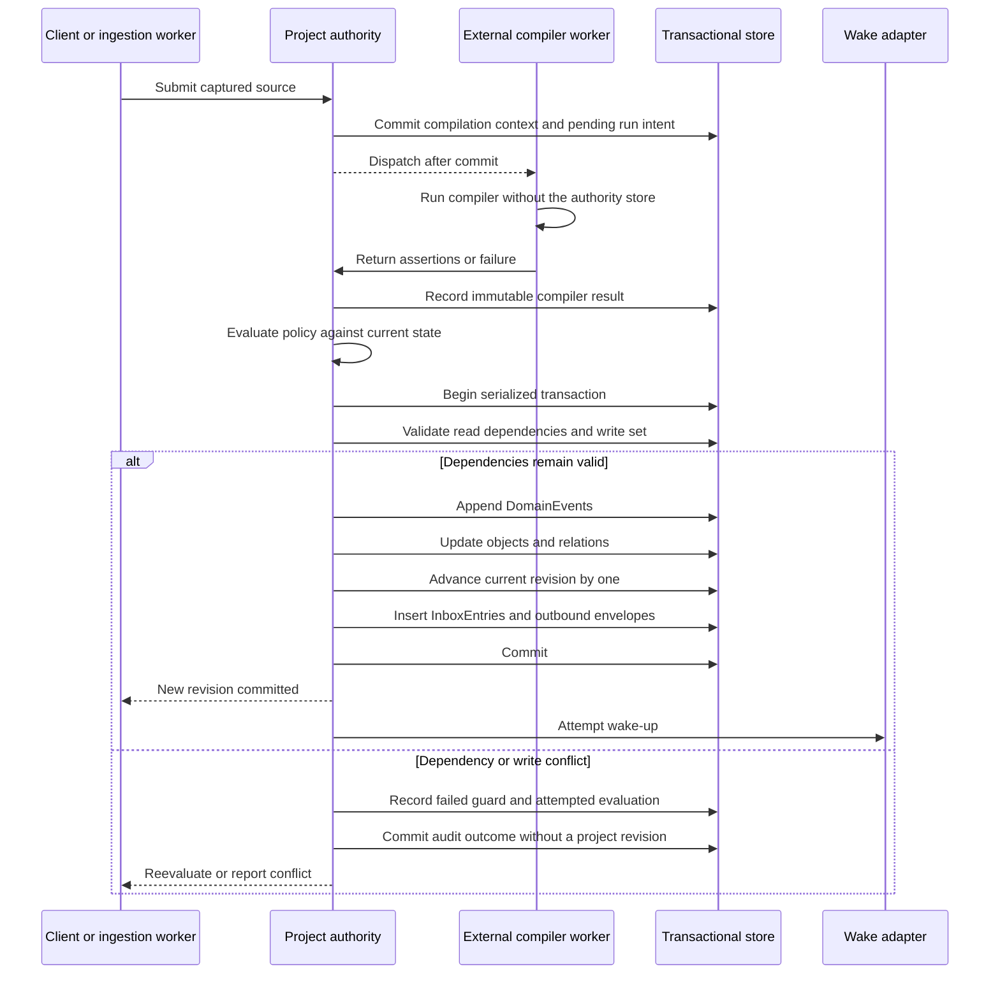
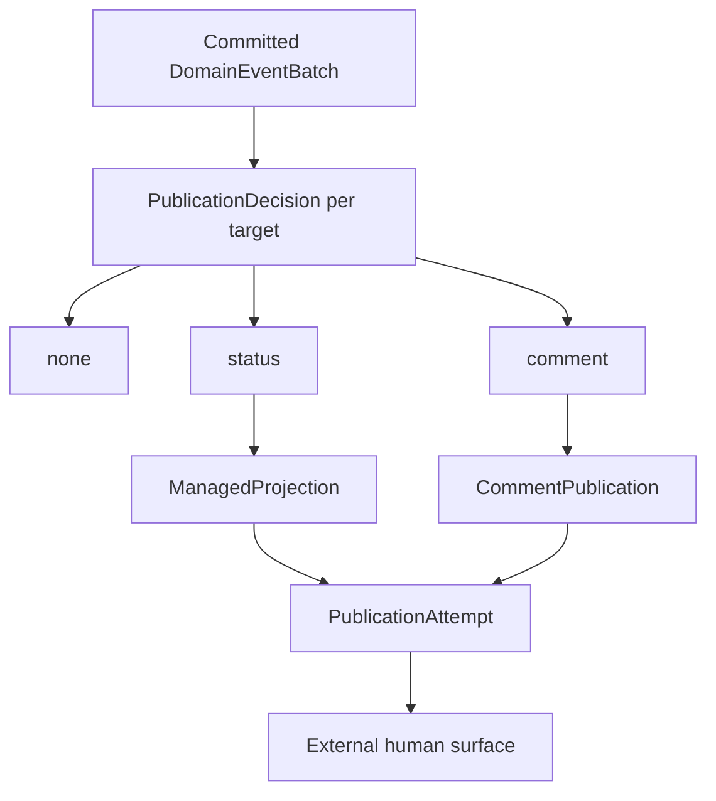

# Merl architecture

Status: draft for implementation

This document defines Merl's implementation architecture. The [product description](product-description.md) explains the product and its intended use. The [user interface and behavior contract](user-interface.md) defines what callers can observe. This document fixes the boundaries, consistency model, and failure behavior that the code must preserve.

## Decision summary

| Area | Decision |
| --- | --- |
| Implementation | Rust workspace with a transport-independent domain core |
| Project boundary | A project may span repositories and other source systems |
| Source relationship | Projects and sources are many-to-many through explicit bindings |
| Cross-project work | Separate state aggregates coordinate through durable envelopes |
| Deployment | Local authority or shared authority behind one domain API |
| Write ownership | Exactly one authority accepts mutations for each project |
| History | Append-only record envelopes with audited erasure of protected payload bytes |
| Current state | Materialized from accepted domain events and rebuildable |
| Compiler context | Bounded, reproducible, and causally limited to an observation cutoff |
| Compilation policy | Binding policy separates compilation timing from coverage requirements |
| Semantic coverage | Views separate accepted revision from compilation freshness and gaps |
| Compiler output | Typed, bounded responses with no default explanatory prose |
| Truth maintenance | Evidence support changes independently from accepted-object lifecycle |
| Policy input | Assertions, commands, provider observations, receipts, and administrative actions share one typed boundary |
| Concurrency | Global revision ordering with dependency and write-set validation |
| Delivery | Inbox entries commit with state; wake-up happens after commit |
| Direct prose | Immutable source evidence; delivery grants no semantic authority |
| Work planning | Commitment, scheduling, and execution remain independent |
| Agent continuity | Structured guidance and checkpoints outlive model context |
| Agent selection | Session advertisements match task requirements with visible reasons |
| Agent provisioning | PMs instantiate only human-approved templates within delegated limits |
| Workspace isolation | One writable worktree and branch per active assignment |
| Temporary storage | Owned disk-backed scratch with reservations, quotas, and safe cleanup |
| Node portability | Secret-free manifests recreate local setup on a new node |
| Human publication | Post-commit, sparse, target-scoped, and retryable |
| Provider authority | External facts remain distinct from Merl semantic overlays |
| Protected content | Arbitrary prose lives behind scope-aware erasable payload references |
| Local trust | Same-user processes are trusted unless the host adds OS isolation |
| Source integration | Polling and webhooks feed one incremental GitHub capture path |
| Agent interface | CLI with hierarchical help and versioned machine output |
| Extraction | Versioned compiler protocol with no authority to mutate state |
| Local storage root | `MERL_HOME`, defaulting to `~/.merl` |

## System shape

Merl has an event-sourced kernel, two state planes, and several adapters.



The event kernel supplies six shared primitives: events, objects, relations, revisions, source references, and actors. Neither state plane owns those primitives.

The knowledge plane holds accepted project knowledge and durable work. The control plane records how agents carry out that work. Control objects refer to knowledge objects by stable ID. They do not copy project state into agent records.

## Project boundary and sources

A `Project` owns one accepted event history, revision sequence, authority policy, membership list, and subscription space. It is the unit Merl serializes. A code repository is one source attached to that project.

The architecture keeps three categories of state separate:

| Category | Examples | Owner |
| --- | --- | --- |
| External evidence | GitHub comments, commits, papers, experiment output | Source system |
| Shared Merl state | Decisions, claims, tasks, findings, cross-source relations | Project authority |
| Local node state | Credentials, caches, logs, workspaces, pending commands | `MERL_HOME` |

A `ProjectSource` identifies an external namespace. Source kinds include repositories, artifact stores, experiment systems, local artifact directories, and future communication connectors.

A `ProjectSourceBinding` connects one source to one project. This many-to-many relationship lets a project use several repositories while one repository feeds several projects. The binding keeps five concerns separate:

```yaml
selection:
  labels: [project-a]

capabilities:
  ingest: true
  compile: true
  publish_comment: true
  create_issue: false

compilation:
  issue_comment:
    mode: eager
    coverage_requirement: required
  bot_comment:
    mode: capture_only
    coverage_requirement: optional
  artifact_report:
    mode: on_demand
    coverage_requirement: optional

credential_ref: github-work
```

Selection decides relevance. Capabilities decide permission. Compilation mode decides when selected prose incurs extraction cost. Coverage requirement decides whether an unprocessed observation prevents a semantic-completeness claim. The credential reference supplies provider access. None grants semantic authority. Each binding keeps its own ingestion cursor, compilation policy, and publication configuration while accepted effects enter the project's revision sequence.

A `Repository` stores a Merl ID, provider, immutable provider repository ID, current human-readable name, and URL. Repository names and ownership can change. Provider identity preserves continuity across a rename or transfer. Issues and pull requests refer to their repository ID plus an immutable provider object ID where available.

Provider-backed work has two projections. The provider mirror records facts owned by GitHub or another source: title, body version, open or closed state, labels, assignees, timestamps, commit SHAs, review state, and merge state.

The Merl semantic overlay records project interpretations such as requirements, phase, blockers, decisions, findings, and research claims. A Merl command may request a provider action, but it cannot report a provider-owned fact as changed until the provider reports that change.

Merl discovers a provider-backed repository from its Git remote and provider API. Local or unrecognized sources receive node-local identities when a user runs `merl source attach`. Repository discovery does not require a committed Merl marker.

Project-level objects do not need a repository owner. A hypothesis may draw evidence from commits in two repositories and a dataset in an artifact store. Relations connect those sources and objects within the same project.

GitHub, Git commits, experiment output, and papers remain external evidence. Merl owns their immutable captures and the accepted interpretations derived from them. It does not claim ownership of the upstream objects.

When several projects consume one provider event, each project runs its own compilation and policy evaluation through its binding. An implementation may deduplicate captured bytes at one authority, but the project interpretations remain independent. A separate `ProviderEvent` layer is a schema optimization rather than an architectural requirement.

## Event pipeline

Merl separates external evidence, machine interpretation, authority, and accepted state. Each layer answers a different debugging question.

### Source events

A `SourceEvent` records an observation outside Merl's accepted state and normally retains the observed bytes. Sources include GitHub comments, issue edits, pull request reviews, direct human or agent prose, commits, local files, experiment output, and evidence uploaded by an agent. A semantic CLI command is a `Command`, not a source event.

A source event contains:

- a stable Merl ID
- the source kind and external entity ID
- a `PayloadRef` to captured content or an artifact
- a content hash and source version when one exists
- a monotonic Merl observation sequence
- the actor and Merl observation time in UTC
- the upstream authored time, numeric UTC offset, and named timezone when available
- upstream creation, update, version, and cursor data when available
- a link to any source event it supersedes

Merl never edits a source event. If a user edits GitHub comment 771, Merl captures a new event with the same external entity ID, a new content hash, and a `supersedes` link to the previous capture. The pair `(external identity, source version or content hash)` provides the ingestion idempotency key.

Merl normally retains captured content because upstream content can change or disappear. An external URL alone is not enough for replay or audit. The metadata record and the retained bytes have different lifetimes: source metadata is append-only, while policy may require deletion or redaction of the content.

An authorized administrative purge removes the retained payload or destroys its encryption key. Merl keeps a tombstone with the source identity, digest, actor, time, scope, and reason. It also marks dependent derivations as having unavailable evidence and reports that affected history can no longer be replayed from the retained store. Purge is an audited exception to byte retention, not a rewrite that pretends the source never existed.

Append-only envelopes must not become a hiding place for copied secrets. They may store IDs, enums, booleans, bounded validated identifiers, numbers, timestamps, hashes, revisions, and `PayloadRef` values. They may not store arbitrary user prose, model output, source bodies, explanations, summaries, or comments inline.

The rule applies throughout both state planes. Decision statements, guidance, handoff notes, request summaries, impact descriptions, publication bodies, and rendered compiler inputs all use payload references. Human-facing examples may show the resolved text, but the stored structural record contains the reference.

A purge preview follows derivation links until it finds no more dependent runs. If one accepted object carries protected text into a later compiler context, the preview includes that context and any results derived from it. Policy may erase those payloads too, leaving structural tombstones and redacted projections. Merl reports the resulting loss of replay fidelity.

Protected payloads do not share deletion fate across projects, principals, or retention scopes. Implementations may deduplicate hashes for comparison, but they must use separate stored copies or separately erasable encryption keys when one scope may delete content while another retains it. A purge guarantee covers the active Merl store and the Merl-managed local copies named by its retention policy. It does not claim erasure from unmanaged backups, filesystem snapshots, provider systems, or previously exported archives.

The first local authority has no managed replicas. During purge, Merl records the intent and erases the selected payloads, scrubs the active SQLite file, then records completion. A reader may delay the scrub after erasure commits. In that case, the command returns a receipt marked pending; Merl retries the scrub on the next open before serving reads. Merl hashes the previewed payloads and derivations, so a changed set requires a new confirmation. The CLI records the actor supplied by the local user; it does not isolate processes running under that user's OS account.

### Compilation contexts

Capture and compilation are separate decisions. Capturing a prose-bearing source stores immutable metadata and an erasable payload without placing its text in an agent context. The effective `CompilationPolicy` comes from the `ProjectSourceBinding`, source kind, actor class, and project override. It has two orthogonal fields: compilation mode and coverage requirement. Source capture records both effective values and the policy version that selected them. A sender cannot force an expensive compiler run through message metadata.

Prose compilation modes are:

- `capture_only`: retain the source without scheduling semantic extraction; policy may compile it later;
- `on_demand`: compile after an authorized explicit request or when accepted work selects the source as evidence;
- `eager`: schedule compilation immediately after capture.

Coverage requirements are:

- `required`: the observation must be processed successfully before Merl claims semantic completeness for its scope;
- `optional`: the observation is retained evidence that may enrich accepted state later, but its uncompiled state does not create a coverage gap.

Coverage requirement is based on trusted structural metadata such as source binding, source kind, actor class, explicit object references, and an authorized policy override. Merl does not read a cold payload to decide whether it is required. Optional sources may appear as cold attachments when their metadata links them to a viewed object, but they remain separate from required coverage gaps.

An authorized administrative policy action may promote an optional source to required for a recorded scope and reason. The requirement belongs to the stable source identity, so an edited successor remains required until Merl processes that version. A sender cannot promote its own prose or otherwise force a compiler expense. `capture_only` with `required` is valid, but the affected scope remains incomplete until an authorized action compiles or excludes the source.

Once that requirement exists, another identical `source require` call reads the accepted requirement and returns it unchanged, even when a different actor makes the call. It does not create a second authorization attempt. A call that asks for different requirement content still goes through policy.

Structured commands bypass compilation because they already carry typed semantics. Trusted provider state changes use deterministic `ProviderObservation` inputs. Merl-generated notifications and projections are marked by origin and never compile. Deterministic extractors may still process structured artifacts without a model call.

`on_demand` triggers are explicit and auditable: an authorized `source compile` command, selection of the source as evidence for a semantic command, or an authorized backfill after policy changes. A compile request records its actor, protected reason, source version, run, compiler, model, and prompt digest before the adapter starts. Rejected requests spend no compiler tokens. Reading the raw payload does not silently compile it. The first implementation will not estimate future readership or automatically spend tokens at a predicted break-even point.

The compiler API keeps these purposes separate. On-demand preparation checks the accepted request against the project, source version, run, compiler and version, executable configuration, model, prompt digest, and every work limit before it records work. Eager preparation accepts only sources captured as `eager`. Replay, evaluation, and hindsight use separate entry points. Fixture setup must use one of those real policies; the production API has no bootstrap bypass.

Coverage requirements and compile requests advance accepted revision and appear in deltas, but they are control state. Role views and compiler context selectors exclude these administrative objects and their protected reasons from ordinary semantic context.

Sensible defaults keep human project surfaces current without compiling routine agent traffic. Human-authored Issue comments are normally `eager` and `required`. Direct agent notes, long reports, research notes, and legacy mailbox imports normally use `capture_only` or `on_demand` with `optional` coverage. Structured provider observations are processed deterministically and remain required. Projects can change those defaults at the binding level.

A new comment rarely makes sense by itself. Phrases such as "same as the first run" or "the frame issue above" require accepted state and a small amount of conversational history. Merl records that input in an immutable `CompilationContext` rather than recompiling an entire thread or asking the compiler to guess.

The context manifest contains:

- triggering source-event IDs;
- `interpretation_basis_revision`, the project revision causally available at the triggering source position;
- the inclusive Merl source-observation cutoff;
- selected object and relation revisions;
- collection or predicate snapshots used during selection;
- recent source-event IDs and their order;
- the context-selection policy, budget, and version;
- the renderer version and exact rendered-input digest;
- a `PayloadRef` to the rendered input when retention policy permits retention.

The context builder starts with the triggering event, materialized state as it existed at the interpretation-basis revision, relevant unresolved objects, and a bounded recent window ending at the observation cutoff. It may include only source observations and accepted state causally available at that position. The first Issue selector puts objects named by a stable handle in the triggering text ahead of other objects, then favors accepted objects attached to that Issue. It records the chosen revisions and whether the budget left objects out. If the named objects cannot fit, context construction fails visibly. Later selectors may expand through relations without crossing the cutoff.

Late `on_demand` compilation preserves the source's historical meaning. If a source arrived at observation 100 when the project was at revision 72, a compilation requested at revision 500 still uses `interpretation_basis_revision=72` and `source_observation_cutoff=100`. The resulting assertions then enter a new `PolicyEvaluation` with `basis_project_revision=500`. Interpretation asks what the source meant then; policy asks what that assertion may change now. A run that deliberately uses later knowledge to reinterpret the source is `hindsight`, not ordinary on-demand compilation.

Historical bootstrap processes the Issue description and each later source observation in sequence. It compiles and accepts each position before constructing the next context. Merl never imports a terminal thread snapshot, derives its final state, and then uses that state to compile earlier comments.

Some provider APIs expose only the latest body of an edited comment. If Merl lacks the prior versions needed for faithful replay, it labels the run `hindsight`. Hindsight may help analysis, but it cannot count as a live or replay result in the no-future-leakage benchmark or enter accepted state without explicit promotion.

If the input remains ambiguous, the compiler returns an unresolved assertion or a structured request for more context. It does not silently load the full history.

Replay uses the recorded manifest, available source bytes, and the run's recorded selector and renderer versions. An older supported selector must rebuild the input it originally chose. An unknown version gets an explicit unsupported-version result; a purge can make exact replay impossible even when the version is supported.

The authority numbers compiler attempts within each project. Coverage selects the latest live attempt by that number and reports erased source or compiler-input bytes separately from a compiler failure. A replay run records a new interpretation without changing accepted project state.

### Compilation runs and observed assertions

A `CompilationRun` records one attempt to interpret a `CompilationContext`. Its provenance includes the compiler name and version, context ID, configuration, prompt or ruleset hash, model identity when applicable, mode, and start and completion times.

Compilation belongs to the project source, not to a recipient or delivery. Several deliveries and later sessions reuse the same accepted derivation while its source and recorded context remain applicable. A source or relevant context change creates a new run; a policy-version change can reevaluate existing assertions without repeating extraction.

Each run records hard output limits:

- maximum assertion count;
- maximum encoded response bytes;
- model output-token limit when the provider exposes one;
- maximum context requests and expansion rounds;
- maximum referenced or newly produced payload bytes.

The normal compiler response contains assertions, source spans, typed relations, confidence and attribution fields, or bounded `context_required` and `unresolved` outcomes. It does not contain a rationale essay, summary essay, chain-of-thought, or copied source text. A bounded diagnostic explanation may use an optional erasable `PayloadRef` when policy enables it. Merl never requests or retains chain-of-thought.

Budget overflow fails the run with a visible outcome. Merl does not silently truncate assertions or enter a context-expansion loop. A later attempt may use a narrower context, deterministic extractor, less expensive model, or stronger model; each attempt remains a separate run with its own provenance. The protocol permits this escalation without requiring an automatic router.

Compilation modes are:

- `live` for normal ingestion
- `replay` for rebuilding causally available prior results
- `eval` for experiments against the frozen corpus
- `hindsight` for analysis that uses information unavailable at the historical position

Mode describes why the run happened. It does not grant permission to change accepted state.

Each run emits zero or more `ObservedAssertion` records. One source may yield several independent assertions, and policy gives each one its own disposition.

An assertion records:

- its subject, predicate, and object or value;
- a speech act such as `claim`, `propose`, `request`, `ask`, or `report`;
- an epistemic basis of `observed`, `inferred`, or `reported`;
- positive or negative polarity and a confidence value;
- the source author, assertion speaker, optional attributed actor, and attribution verification state;
- one or more source spans as byte ranges or stable block IDs within a specific payload version;
- semantic relations such as `answers`, `addresses`, `supports`, `updates`, or `disputes`.

Contradiction is a relation or support status derived by comparing evidence, not an epistemic basis. `unable_to_determine` is a compiler outcome and produces no assertion unless the inability itself is relevant project state. A relay does not inherit the attributed actor's authority. If the original statement exists as another source event, policy evaluates that event rather than treating a paraphrase as equivalent evidence.

Relative time is normalized against the authored timestamp and timezone while preserving the original expression. Expressions tied to events, such as "after the pull request merges," become object predicates or wait conditions rather than guessed dates.

Compilation runs and assertions are append-only. Running compiler version 0.7 against a source previously handled by version 0.4 creates another run and another set of assertions. It does not replace the earlier interpretation.

Compilers cannot write accepted objects or domain events. Built-in Rust compilers call a narrow core API. Experimental compilers use a versioned process or service protocol and return assertions through the same boundary.

### Evidence change and reconsideration

An assertion remains a historical record of what one compiler inferred from one context. Editing or deleting its source does not mutate that assertion. The new source event instead creates an append-only evidence-impact record for every dependent context, assertion, support relation, and accepted object.

Accepted-object lifecycle and evidence support are separate. An object may remain `active` while its support awaits revalidation. Individual support relations use `current`, `evidence_changed`, `revalidation_pending`, or `unsupported`. The object view derives an aggregate support status: `current`, `revalidation_pending`, `partially_supported`, or `unsupported`.

Source supersession records one impact for each accepted support that cited the old source or used it in its compiler context. The impact names the affected compiler run, so a restarted authority can reconstruct the work. For a context edit, Merl replaces the changed version in that run's recorded source window and records a new hindsight run. The assertion may still cite the original trigger; Merl resolves the impact only after policy accepts the revised interpretation.

The impact itself is the queryable `evidence_changed` fact. Its pending action remains visible until resolution, and neither record rewrites the original assertion. A material correction may instead supersede or invalidate the old object through policy. If the source bytes disappear, the view marks that support unavailable. The later administrative purge workflow must audit the erasure and its retention scope; low-level payload erasure alone does not make that claim.

After restart, the authority can list pending impacts across the project. Each entry names the affected object and support event, earlier run, trigger, changed source, replacement when present, and next action. Resolving the work removes it from that list but leaves the impact record in place.

### Policy evaluations

A `PolicyInput` is an immutable semantic proposal presented to policy. Its kinds include `ObservedAssertion`, `Command`, `ProviderObservation`, `CrossProjectReceipt`, and `AdministrativeAction`. This keeps direct user actions honest: a command-created decision does not pretend to have a source event or compilation run.

A `PolicyEvaluation` decides how Merl should treat one or more policy inputs. It evaluates them together with accepted state at `basis_project_revision`, which is independent from any compilation context's historical interpretation basis.

The evaluation records:

- typed input IDs and their individual dispositions
- the policy version and configuration
- `basis_project_revision`
- object, relation, collection, and predicate dependencies read during evaluation
- the proposed write set
- the actor or process that requested evaluation
- the result and reasons
- proposed state mutations
- the exact input that produced each domain event appended by a successful commit

Possible input dispositions include accepted, candidate, rejected, duplicate, and conflict. One evaluation may accept one input while rejecting another, even when it considered both together.

The evaluation record remains immutable. A successful commit links each accepted event to its producing input in the same transaction as the event. Expanding an object's latest event can therefore name the exact input, even when one evaluation accepted several proposals.

Policy applies authority as well as confidence. Merl may accept a deterministic observation from a trusted machine artifact. It may accept an explicit decision from a human who has authority over that project. An agent's interpretation of research direction can remain a candidate. Closing an issue, approving a merge, or superseding a major decision can require explicit permission.

Trusted provider facts follow a deterministic policy path. For example, an authenticated GitHub observation that an Issue is closed requires provenance and monotonic-version checks, not model interpretation. The accepted `provider_issue_state_observed` event updates the provider mirror, advances the same project revision used by semantic changes, and reaches agents through the normal delta and inbox path.

If a later poll confirms the same provider facts, Merl records an append-only sighting and updates the mirror's last-seen time without advancing the project revision. A rebuild restores the mirror from accepted provider observations and those sightings. A different snapshot observed before that last-seen time cannot replace the current mirror.

Replay and evaluation results do not enter accepted state on their own. Promotion creates a new policy evaluation against current state. The original inputs remain unchanged.

### Actors and commands

A client asks the project authority to act by submitting a `Command`. Commands include semantic operations such as resolving a question, assigning a task, or recording an experiment result. They are requests for evaluation, not accepted events.

A command contains:

- a globally unique command ID
- the project ID and basis revision
- the requested operation and arguments
- the authenticated actor
- the submission time and client metadata

A structured command may carry an optional supplemental prose payload. The command receipt records that payload's source identity. If policy accepts the command, the accepted transaction relates the source to the command, domain-event batch, and created or changed objects through `semantic_origin` and `supplements` edges. If policy rejects the command, the source remains linked to that outcome without pretending an accepted object exists.

When supplemental prose compiles later, its context includes those lineage edges and the semantics already represented by the structured action. The compiler extracts new evidence, constraints, corrections, and other acts rather than recreating the origin. A repeated act may still be emitted for safety, but policy records it as covered or duplicate through strong lineage instead of creating another task or decision.

The authority stores command receipts and outcomes. Retrying an accepted command cannot apply it twice, and reusing its ID with different content is an identity conflict. A retry with the same evaluation ID returns that evaluation's recorded outcome. A rejected or candidate command may receive a new evaluation under later policy rules without changing its original receipt or outcome. The command enters policy as a typed input and may produce a domain-event batch.

A disconnected client queues commands, not domain events. On reconnect, the authority checks the basis revision, authenticates the actor, applies current policy, and either commits a new domain-event batch or returns a conflict. Only the project authority creates accepted domain events.

An `Actor` has a stable Merl identity and may link to provider identities such as an immutable GitHub user ID. `ProjectMembership` assigns roles and permissions within a project. The authority derives the actor from authenticated credentials; it does not trust a client-supplied display name.

### Domain events and materialized state

A `DomainEvent` records an accepted change. Examples include `decision.activated`, `question.resolved`, `claim.invalidated`, and `assignment.created`.

Every accepted transaction groups its domain events under one stable `DomainEventBatch` ID and project revision. Subscription matching and human publication evaluate the batch as a whole rather than treating each event as a separate human occurrence.

Domain events are append-only. A correction emits another event that supersedes or reverses the earlier effect. Merl does not rewrite the historical record.

Materialized objects, relations, and provider Issue heads are disposable projections. Merl rebuilds objects and relations from accepted domain events, then restores provider heads from accepted provider observations and recorded sightings.

An Issue view keeps provider-owned facts apart from Merl's decisions, questions, and other semantic objects. Each semantic object shows both its accepted lifecycle and the health of its supporting evidence. A source edit can leave a decision active while its evidence awaits revalidation; a later accepted decision can supersede it even when that original evidence remains sound. Relations such as `supersedes` record how those decisions connect. Rebuilding the projection must preserve all three: lifecycle, support, and relations.

## State planes

### Knowledge plane

The knowledge model covers concepts that Merl's intended users already use:

```text
Work             Issue, PullRequest, Task
Coordination     Decision, Requirement, Question, Blocker
Knowledge        Fact, Artifact, Finding, Claim, Evidence
Research         Hypothesis, Experiment
Software         Contract
Cross-project    OutboundRequest, InboundRequest
```

The model should preserve these concrete names. A premature abstract ontology would make agents and users translate ordinary project language into Merl's language.

Some types need a discriminator rather than another top-level type. `Finding.kind` can distinguish a review finding from an experimental finding. `Claim.domain` can distinguish research, software, and other claims. `Artifact` remains broad enough for files, commits, logs, datasets, papers, reports, and remote blobs.

Relations connect objects without embedding copies. Examples include:

```text
Question resolves_to Decision
Decision supersedes Decision
Finding blocks PullRequest
Experiment tests Hypothesis
Evidence supports Claim
Contract applies_to PullRequest
Task depends_on Task
```

### Work requests and planning

A `Task` may begin as a request from a person, an agent, ingestion, or an inbound cross-project request. Its existence establishes that the project knows about the work. It does not establish that the project has committed to doing it.

Tasks and inbound requests expose three independent facets:

| Facet | States | Meaning |
| --- | --- | --- |
| Commitment | `pending`, `accepted`, `declined` | Whether the owner has taken responsibility |
| Scheduling | `unscheduled`, `deferred`, `scheduled` | Whether and when the owner plans to revisit or perform it |
| Execution | `not_started`, `in_progress`, `blocked`, `completed`, `cancelled` | What has happened in carrying it out |

Not every combination is legal. Declined work cannot start. Completed work cannot return to `in_progress` without a new corrective transition. Policy owns those rules; the model does not encode them in one overloaded lifecycle enum.

Deferral requires a reason and at least one reconsideration trigger: a review time or a relation to an accepted project condition. A deferred item can remain `pending` when the owner has made no commitment, or `accepted` when the owner has committed but has not scheduled the work. Renderers always show commitment with scheduling.

Requester constraints and owner commitments use different fields. `needed_by` and `impact_if_late` state the requester's need. `target_start` and `target_finish` state the owner's schedule. Merl detects and displays a mismatch but does not resolve it by changing priority.

Planning transitions are accepted project state. They advance the project revision and notify requesters, assignees, and other subscribers. An agent's actionable queue contains accepted, assigned work whose scheduling permits execution. Deferred work remains visible in planning views but is not actionable.

Deferring an `in_progress` task requires an explicit pause transition. The authority does not treat a date change as an instruction to kill a running process. The pause records or requests a checkpoint, releases any execution lease according to policy, and preserves the assignment history.

### Control plane

The control model contains:

```text
Agent, AgentTemplate, SpawnRequest, ProvisioningAttempt,
AgentSession, AgentAdvertisement, ContextPolicy, Assignment, Subscription,
InboxEntry, Cursor, Lease, Checkpoint, Handoff, WaitCondition, Acknowledgement,
AgentProfile, AgentGuidance, CrossProjectEnvelope, EnvelopeReceipt,
MessageDelivery, SessionInboxLease, HostAction
```

An `Assignment` connects an agent to a knowledge-plane `Task`. If the assignment expires, the task remains. A `WaitCondition` describes a runtime pause; a knowledge-plane `Blocker` describes an accepted project constraint. A task's durable review condition belongs to its scheduling state, while a `WaitCondition` parks one agent execution.

Current leases and process sessions may expire. Assignment history, checkpoints, handoffs, acknowledgements, and failed delivery records remain available for recovery and diagnosis.

A checkpoint records the project revision an agent understood and references the relevant knowledge objects. It does not copy those objects into a session summary. A handoff may reference a short note payload, but its durable context comes from object and artifact references.

### Agent guidance and context assembly

An `AgentProfile` gives one logical agent a stable identity independent of a process, session, model provider, or computer. Restarting the agent or clearing its model context does not create another logical agent.

`AgentGuidance` stores durable operating guidance with one of three kinds:

- `instruction` for behavior required by a human or project policy
- `practice` for an adopted working method
- `lesson` for an observation proposed for reuse

Each record has scope, a statement payload reference, provenance, author, authority, priority, lifecycle, and creation revision or local profile version. Lifecycle states are `proposed`, `active`, `superseded`, and `retired`. Policy decides who may activate guidance at each scope. Project-scoped guidance is durable control state in the project authority. Personal or cross-project guidance belongs to the portable agent profile on the user's node.

Guidance is not a message and does not become project knowledge. It may shape how an agent works, but accepted project requirements, decisions, and safety policy take precedence. Structured records allow Merl to select relevant guidance without injecting an unbounded memory transcript.

Session resume is a deterministic context projection, subject to a rendering budget. It considers, in order:

1. logical agent identity and current role
2. active guidance relevant to the project and task
3. actionable assignments
4. the latest checkpoint and its references
5. accepted changes since the checkpoint cursor
6. current versions of referenced project objects

Durable guidance is stored once but must be rendered into each new model context to have any effect. A host-managed session receives one bounded bootstrap instruction that identifies the logical agent and tells it to run `merl session resume --agent <id> --format json`; it points to hierarchical help for further discovery. The bootstrap does not contain the agent's guidance, assignment, transcript, or command catalog. An externally started process receives the same line from `merl agent attach` for the user or host to inject.

A checkpoint preserves continuity, not truth. Current accepted state wins when a checkpoint note has gone stale. Removing model-host context leaves profiles, guidance, checkpoints, and project state untouched. Retiring or superseding guidance requires an explicit durable operation. Retirement removes guidance from future context but preserves its audit history.

### Delegated agent provisioning

An `AgentTemplate` defines the limits within which a project manager may create agents. A human or another actor with delegation authority sets:

- role and allowed projects
- host adapter and model or effort bounds
- project permissions and credential references
- context, workspace, review, and storage policies
- concurrency and relative cost limits

The template contains credential references, never secret values. Changing a template or its delegation requires the same authority as the original grant.

An authorized PM submits a `SpawnRequest` against one template and task. Policy checks the delegation, task state, concurrency, cost allowance, source access, and storage reservation before accepting it. The accepted transition creates a logical agent instance or selects a reusable identity, reserves its resources, and writes a durable provisioning intent.

A host worker acts after commit. Each `ProvisioningAttempt` records the host, template version, requested runtime, time, result, and external session reference. Host failure leaves the request failed or retryable; it does not mark the agent available. Only a ready session may advertise availability, receive a workspace lease, and start an assignment.

PMs may drain or stop agents created under their delegation. Draining blocks new assignments and lets current work checkpoint. Stopping follows the session-closure rules and releases reservations only after the host confirms exit. A PM cannot widen permissions, reveal credentials, change template limits, or provision an unapproved runtime.

An urgent stop still begins as durable state. One accepted transaction records `cancellation_requested`, `interrupt_requested`, and a pending `HostAction`; the host worker attempts the interrupt immediately after commit. Interrupt requested, host action delivered, process stopped, and task cancelled are separate facts. Failed delivery remains visible and retryable rather than being hidden behind an urgent message. A host action targets an adapter-issued session handle with process-start identity; a PID file alone is never sufficient because PIDs can be stale or reused.

Humans may attach an externally started process to an approved logical identity. The authority still checks project membership and template constraints. Merl marks runtime fields with their actual provenance rather than treating an attached process as host-attested.

### Context lifetime

An `AgentSession` is one disposable model-context generation for a logical agent. `ContextPolicy` controls when Merl asks the host adapter to end that generation:

| Mode | Behavior |
| --- | --- |
| `continuous` | Keep context across related assignments until explicitly closed |
| `task-scoped` | Close context after the bound task becomes non-actionable |
| `manual` | Record checkpoints and closure readiness but never clear automatically |

The mode is configurable by agent and may have a project-specific override. Roles can provide defaults, but Merl does not assume every developer is task-scoped or every manager is continuous.

A task-scoped session closes through a durable transition before any host side effect. The accepted transition records the final checkpoint, task outcome and references, cursor, proposed guidance, assignment state, and lease release. After commit, a host adapter clears or replaces the model context. Failure leaves a retryable context action and never rolls back the checkpoint or task state.

Automatic closure requires the bound task to be completed, cancelled, deferred, or otherwise non-actionable according to policy. Merl does not reset an agent with active work merely because another task arrived. A user can request an early close, but the same checkpoint and lease-release rules apply.

The next session receives a new generation ID and the bounded resume projection. Active guidance such as a TDD practice survives; transcript tokens and incidental reasoning from the previous task do not. A continuous session still consumes role deltas and bounded views so its context need not grow without limit.

### Runtime advertisements and assignment

An `AgentAdvertisement` describes the runtime available for one `AgentSession`. It records:

- provider and model identifiers as versioned strings
- host reasoning-effort value and a normalized effort class when available
- declared capabilities and tool or source access
- availability and current assignment load
- context-policy and host reset support
- relative cost class and measured usage when available
- provenance and observation time for every field

The advertisement belongs to the session, not the logical `AgentProfile`. A new session publishes a new advertisement. Historical advertisements remain attached to their assignments and outcomes, while stale sessions are not eligible for new work.

Host-attested values are preferable. Operator-configured and self-reported values remain useful but carry their actual provenance. Merl does not present a self-reported model, capability, or effort level as independently verified.

Effort names are not assumed to mean the same thing across hosts or providers. Merl preserves the raw host value and applies a versioned, provider-specific normalization only when assignment policy needs a comparable class.

A `Task` may carry assignment requirements: necessary capabilities and access, minimum reasoning demand, risk, required review path, budget preference, and concurrency constraints. These fields describe the work rather than naming a preferred agent.

Candidate selection first removes ineligible sessions, then orders the remainder through a versioned assignment policy. The result explains each inclusion, exclusion, and tradeoff. A cost-preferring policy selects the least expensive eligible runtime; it never chooses a cheaper session that misses a hard requirement. A capability-preferring policy can favor additional headroom for risky or difficult work.

Selection is advisory until an authorized actor commits an `Assignment`. That record captures the chosen session advertisement, task requirements, policy version, and human or automated rationale. Runtime properties grant no project membership, source capability, or authority.

### Concurrent repository work

A `Workspace` is node-local operational state that connects an agent session and assignment to one source checkout. Its record contains the source ID, task and assignment IDs, canonical path, filesystem identity where available, access mode, strategy, Git object store, branch or detached commit, base revision, creation time, and lease state.

The default strategy for a writable assignment on one node is a managed Git worktree:

```text
~/.merl/
  git/<repository-id>.git/                 shared object store
  workspaces/<project>/<task>-<agent>/     independent worktree
```

Each writer receives a unique branch, such as `merl/<task-id>/<agent-id>`. Worktrees may share the object database, but they do not share a working directory, index, checked-out branch, or process current directory. Merl does not place managed worktrees inside another repository's working tree.

An attached user checkout can serve as a workspace only when it has an exclusive writable lease. A second writer receives another worktree. Read-only assignments use a detached worktree at a pinned commit by default. Multiple readers may share that immutable checkout only when the host or filesystem adapter enforces read-only access; they do not share a writer's live working tree.

The workspace registry canonicalizes paths, resolves symbolic links where possible, and inspects Git worktree identity before granting a lease. Two active writable leases cannot resolve to the same working tree. The shared Git object store is allowed and managed separately from workspace ownership.

Merl uses a full clone when worktrees are unsupported, an isolation policy requires separate object stores, or repository-specific behavior makes sharing unsafe. The selected strategy is visible in the workspace record. Containers or remote workspaces can implement the same interface later.

Reviewers do not check out a writer's active branch in the same worktree. A read-only review workspace uses the reviewed commit in detached mode; a reviewer that may commit receives a separate branch and writable workspace.

Build outputs remain workspace-local by default. Tool caches may be shared only when their adapter declares concurrent access safe; sharing the Git object store does not authorize sharing compiler output directories.

Workspace release is conservative. Merl checks the index, untracked files, commits not reachable from a preserved ref, and publication state before removing or reusing a workspace. Dirty or unpreserved work blocks automatic cleanup. Completing or closing an agent session does not override those checks.

Each workspace has separate storage classes:

```text
scratch/<workspace>/tmp/        disposable process temporary files
build/<workspace>/              reconstructible build and test output
tool-cache/<tool>/              bounded cache, shared only when safe
artifacts/                      durable referenced outputs
```

`MERL_SCRATCH` selects the scratch root and defaults to `${MERL_HOME}/scratch`. The host adapter sets `TMPDIR` for the agent process. Tool adapters may also set `XDG_CACHE_HOME`, Python bytecode paths, pytest's base temporary directory, Rust's target directory, or comparable tool settings. Build output stays workspace-local unless an adapter guarantees safe concurrent sharing.

Merl inspects the scratch filesystem and reports memory-backed or swap-sensitive mounts. A project can forbid them. Node high and low watermarks, per-workspace allowances, and spawn-time reservations keep one agent from consuming the machine. Portable filesystems may provide accounting without hard enforcement; adapters for filesystem quotas or containers can add hard limits.

The janitor owns only paths created beneath a configured Merl storage root and carrying the expected ownership marker. It waits for the workspace lease and tracked processes to end, then removes scratch and trims reconstructible caches. It never sweeps the system `/tmp`, a user checkout, durable artifacts, or unknown paths.

An agent started outside the Merl host adapter may bypass environment routing and resource enforcement. Node status reports that gap. Merl can audit known workspace and scratch paths, but it does not claim control over unowned process output.

Workspace separation prevents local filesystem corruption, not semantic merge conflicts. Tasks may advertise affected paths, components, or contracts. Assignment policy can warn about overlapping active work or serialize it, while Git and pull-request integration decide how changes merge.

## Cross-project coordination

Projects act as bounded contexts. Each project owns its accepted history and local interpretation of an exchange. Cross-project coordination synchronizes related state without creating shared mutable objects.



### Separate request aggregates

The origin owns an `OutboundRequest` that states what it needs, why it needs it, and which constraints or exports support the request. The target imports the exchange as a separate `InboundRequest`. The objects share correlation but never share mutable fields.

The origin controls its need, `needed_by` constraint, impact statement, exported context, amendments, and withdrawal requests. The target controls commitment, scheduling, local priority, implementation, ownership, and fulfillment. A withdrawal request does not cancel target work until the target accepts it. A target fulfillment claim does not force the origin to accept that its need has been met.

The end-to-end view is a projection over both aggregates. Request exchange may be submitted, withdrawn, or disputed. The target reports its commitment, scheduling, and execution facets separately. A target can defer a pending request without accepting it, or accept responsibility and schedule it for later. Each transition belongs to the project that made it; the other project records an observation of remote state.

### Directional links and contracts

A `ProjectLink` is directional and defaults to no access. It grants specific request kinds, contract versions, and export selectors from one project to another. Reverse traffic requires another grant.

Cross-project contracts type the coordination act and its durable consequence without encoding the sender's full reasoning. A request contains a versioned kind, readable summary, small typed payload, constraints, and references:

```yaml
kind: infrastructure.change
version: 1
summary_payload: PL81
constraints:
  required_before: E42
  needed_by: 2026-10-01
  impact_payload: PL82
refs:
  - snapshot: project-a:D18@4
  - live: project-a:T42
```

The target advertises supported kinds and versions. It rejects an unknown version with a durable compatibility outcome rather than guessing at its meaning.

Cross-project references have three forms:

- `LiveRef` resolves current state exposed by the origin project.
- `PinnedRef` resolves one exported object revision.
- `SnapshotExport` carries an immutable projection and digest.

Requests usually use pinned references or snapshots for the information that justified submission. Live references provide later updates. Object IDs do not grant ambient read access; exports and link policy define what the target may resolve.

### Atomic outbound intent

An accepted outbound transition and its `CrossProjectEnvelope` commit in the same origin-project transaction:

```text
BEGIN
  append origin DomainEventBatch
  update origin materialized state
  advance origin project revision
  insert origin InboxEntries
  insert pending CrossProjectEnvelopes
COMMIT
```

A transport worker delivers pending envelopes after commit. A process crash cannot leave accepted state claiming submission without a durable delivery intent.

The envelope contains a stable envelope ID, origin and target projects, origin revision and transition ID, correlation ID, causation ID, contract kind and version, payload hash, summary `PayloadRef`, references, and hop count. The resolved human-readable summary must remain understandable without Merl IDs.

### Durable receipt and target policy

The target authenticates the origin project and checks its directional link before acknowledging transport. It persists the immutable envelope receipt idempotently, then acknowledges possession. A transport acknowledgement means the target has the envelope; it does not mean the target accepted the request.

Target policy processes the receipt and may create an `InboundRequest` in a later target-project transaction. That transaction can also create target-owned tasks, questions, inbox entries, and an outbound lifecycle update. No transaction spans two projects or an external provider.

The same protocol applies when one process hosts both projects. The implementation cannot bypass the boundary through direct database mutation.

### Idempotency and lineage

Merl handles duplicates at distinct layers:

- Repeated envelope ID means transport retry and returns the stored receipt.
- Repeated origin transition ID means the transition was already imported.
- Similar request content is a policy question and may represent legitimate new work.

Correlation and causation IDs retain the exchange lineage through requests, tasks, GitHub issues, and updates. Repeated project identity in a lineage is valid. A path such as Project A to Project B to Project C and back to Project A may carry a needed question and answer.

Merl detects duplicate work from the same correlation, request kind, semantic transition, and processed origin transition. It may flag suspected semantic recursion for policy. A configurable maximum hop count provides a safety valve without treating every graph cycle as an error.

Derived external artifacts retain their request lineage. If the origin later ingests a target-created GitHub issue, it updates the existing exchange rather than inferring another request from that issue.

## Revisions and concurrency

Each project has a monotonically increasing `project_revision`. Each materialized object also has an `object_revision`. The project revision orders accepted changes and drives cursors; it does not make every prior evaluation stale.

A policy evaluation records `basis_project_revision`, read dependencies, and a proposed write set. Read dependencies may name an object or relation revision, a collection version, or a predicate guard such as "no active decision exists for this key." Merl commits an accepted batch as follows:



An unrelated project change does not invalidate an evaluation when every recorded dependency still holds and the write set does not conflict. If a dependency changes before commit, the authority records the attempted evaluation and the failed guard without advancing project revision or notifying agents. The client receives a conflict and may request reevaluation. Compilation output remains immutable and need not run again merely because policy reevaluates it.

If two evaluations prepared the same input before either committed, the first accepted transition wins. The authority records the second as a duplicate without creating another revision. When only part of a prepared batch overlaps accepted work, the authority records a conflict so policy can reevaluate the remaining inputs together.

Object IDs alone cannot describe every dependency. A policy that depends on the absence of an object records a predicate or collection guard so a concurrent insertion invalidates the evaluation. The authority serializes the final transaction after these checks.

An accepted batch commits in full or not at all. Domain events never become visible without their materialized state, revision, and inbox entries.

## Inbox and wake-up behavior

Inbox delivery follows the transactional outbox pattern. Subscription matching runs before commit and creates one durable `InboxEntry` for each affected agent. An entry contains the agent ID, committed project revision, relevant object references, delivery state, and acknowledgement state. Large source text does not belong in the entry.

After commit, the daemon asks the configured host adapter to wake the agent. Host adapters may use Codex App Server, a Claude integration, a process signal, or another supported mechanism. Wake-up failure leaves the inbox entry pending. A background dispatcher retries with bounded backoff.

Delivery is at least once. Agents process inbox entry IDs idempotently and acknowledge them after they have persisted their cursor. Duplicate wake-ups are harmless. A missed wake-up delays work but cannot hide a committed change.

Transport states remain factual: created, queued, delivered, claimed, and acknowledged. Acknowledgement means receipt or durable cursor advancement. It does not mean agreement, understanding, task acceptance, question resolution, or completed work.

One active `SessionInboxLease` owns the actionable cursor for a logical agent. Other sessions may inspect the inbox without advancing it. Concurrent consumers require separate logical agents until Merl has an explicit worker-pool model.

Subscriptions select semantic changes, not message senders. A reviewer may subscribe to findings and contract changes for a pull request. A researcher may subscribe to hypotheses, experiment results, and research claims. Merl computes the delta from the agent's cursor when the agent reads its inbox.

### Direct prose and conversation links

Human- or agent-authored direct prose enters as a `SourceEvent` with an erasable payload. Delivery grants it no authority. Compilation may derive several assertions, and policy decides each assertion independently. Merl-generated notifications and projections retain their originating batch or command ID and never re-enter semantic compilation.

Conversational links such as `in_reply_to` preserve provenance only. They do not close requests. Questions, findings, tasks, and decisions change through explicit semantic relations and domain events, so one message may address several objects and several messages may address one object.

Adapters may retain labels such as `ready`, `question`, or `ack` as source metadata. Those labels are compiler hints, not lifecycle transitions. Provider observations and accepted semantic state decide whether a pull request exists, a question is resolved, or work is ready.

One authored note may have several `MessageDelivery` records. A state change similarly fans out as several inbox entries without duplicating its semantic origin. Merl deduplicates only through strong lineage such as the same source, command, forwarding, or originating transition ID. Text similarity may flag a possible duplicate but cannot silently merge two statements.

## Human publication

GitHub and similar providers are sparse human collaboration surfaces. Merl keeps its domain-event log inside the project authority and publishes selected human-relevant changes.

Ingestion and publication use separate capabilities. Several projects may ingest one external object, but one configured project owns each publication slot. A slot covers an append-only comment stream or a managed status surface for a specific external object. For the first implementation that supports shared sources, a multiply-bound Issue has one publishing project; every other binding is ingest-only.

Publication starts only after an accepted batch commits:



A publication worker reads committed batches from a durable cursor. For each affected external surface, it records an append-only `PublicationDecision` with the batch ID, project revision, target, policy version, outcome, and reason. One batch may yield decisions for several issues or pull requests. Evaluating the batch as a whole prevents one human event from becoming several comments.

Most decisions choose `none`. Publication policy reserves `comment` for human-significant events such as accepted decisions, changed requirements, serious blockers, answers to human questions, significant research conclusions, and merge-blocking findings. Routine facts, acknowledgements, cursor changes, handoffs, and minor derived transitions remain in Merl.

Publication classification records whether it used deterministic rules or a model. Model-backed decisions retain the classifier version, model identity, prompt hash, and input references. Classification never runs inside the accepted-state transaction.

### Comment publications

A `CommentPublication` is an append-only human-facing event. It may summarize several domain events from one accepted batch. Its stable publication ID, target, source object references, renderer version, project revision, content hash, and desired-body `PayloadRef` support audit and idempotent delivery.

Generated comments lead with ordinary language. A Merl ID appears as a handle after the meaning, for example:

```text
Keep receive gain fixed during baseline captures. (D18)
```

Removing Merl IDs from a generated comment must leave its human meaning intact.

### Managed status projections

A `ManagedProjection` is a bounded materialized view for one external slot, such as `github:issue:204/merl-status`. It tracks desired revision and hash, published revision and hash, external object ID, and drift state.

Status renderers show only current phase, goal, blockers, questions that need human input, next work, recent decisions, and important artifacts. Configurable character and item limits provide deterministic bounds. Merl records estimated token count for observability while enforcing the character and item limits.

Status is replaceable and coalescible. If revisions 483 through 485 arrive before publication, Merl may publish only the desired state at revision 485. Publication decisions preserve the audit trail even when an intermediate rendering never reaches GitHub.

### Attempts, reconciliation, and drift

A `PublicationAttempt` records one external write or reconciliation attempt. It includes the desired publication identity, provider, target, authenticated publishing actor, attempted content hash, time, and result. Attempts are append-only and happen after accepted state commits. Provider failure cannot roll back a project revision.

A provider actor proves which account wrote a publication, but it does not by itself prove which Merl project originated it when several projects share a bot account. Cross-authority recognition therefore requires a trusted project-to-authority mapping or signed publication metadata. Until that mechanism exists, only the publishing authority treats its record as verified Merl output; other projects ingest it as ordinary external material or remain ingest-only by policy.

Every external write has a stable idempotency identity. Where the provider permits it, Merl embeds a non-disruptive marker. Merl also verifies its own publication record, authenticated provider identity, target, object type, and content hash. If a request may have succeeded before the connection failed, Merl reconciles against the provider before retrying.

Merl publications carry a stable, cross-project publication ID and the publishing project ID. The provider actor, target, object type, and content hash support verification; a hidden marker alone is never trusted. An authority recognizes another project's output only after authenticating that project through its configured link or authority mapping.

When a verified publication returns through source ingestion, Merl captures the provider event and marks it as `origin=merl_projection`. It does not send that event through ordinary semantic compilation. Cross-project meaning travels through an explicit export or request rather than by compiling another project's generated prose.

If someone edits a managed projection, Merl records projection drift and warns or restores the desired view according to project policy. The edit never becomes accepted-state input.

### Renderer constraints

A renderer receives accepted objects at a recorded project revision. It may express those objects in readable prose, but it cannot introduce new project facts. Its output is retained through a `PayloadRef`. Deterministic renderers are preferred. A model-backed renderer records its version, model identity, prompt hash, input references, and output hash.

## Views and progressive disclosure

A view selects relevant accepted objects before it orders them. In the first release, you can name a focus object. Merl puts that object and its direct relations first, then fills the remaining space according to role. Two engineers focused on different tasks start with different context. Without a focus, researchers see hypotheses and findings first; engineers see implementation work and requirements first; PMs see tasks and blockers first. The multi-agent milestone can supply focus from an assignment.

All three roles read one accepted state. Views hide superseded objects by default and report truncation. A focused project view still reports project-wide semantic coverage, so it cannot claim task-specific completeness.

Inbox entries and project deltas carry bounded reference pages. A truncated page includes a batch ID and an offset for the next page. The batch remains readable after acknowledgement, so advancing an inbox cursor cannot erase access to omitted references. A new subscription starts at the current project revision; it receives future changes, not a partial replay of earlier history.

Accepted project revision and semantic coverage answer different questions. A revision says which accepted events the view contains. `SemanticCoverage` says whether every coverage-required observation for that view's scope has been processed. It records:

- the source observation head;
- the greatest observation cutoff through which every required observation has processed successfully;
- required observation holes and whether each is cold, pending, failed, purged, or excluded by policy;
- counts of optional cold sources linked by structural metadata;
- pending and failed compilation counts.

A single watermark cannot hide required holes. Coverage is scoped to the role view or query, so unrelated material does not add noise. A negative answer is qualified when required sources are cold, pending, or failed: `No accepted blocker; two required sources remain uncompiled.` Optional sources never weaken the completeness claim merely because their payloads are cold. If structural metadata links them to the view, Merl reports them separately, for example `One optional cold note is attached to T42.` A view is semantically complete when all required observations through its head have processed successfully and no required work is pending or failed.

Merl exposes four levels of detail:


Renderers must be deterministic for a fixed state and configuration. Merl provides compact text and JSON. YAML may help humans inspect state. A symbolic codec must earn its complexity through measured task performance.

Token metrics include the initial view, expansions, source reads, clarification turns, compiler work, and corrections. Merl does not claim a saving when a small but ambiguous view moves cost into later calls.

## Runtime and process model

Exactly one authority serializes accepted mutations for a project. The authority runs ingestion, policy evaluation, projection updates, inbox dispatch, and API handling. Clients submit commands through it rather than writing the accepted store.

The authority uses a bounded request mailbox and one serialized commit path. A synchronous store worker owns the authoritative SQLite connection. Model, provider, host, and publication work runs outside its transactions and does not borrow the connection while waiting. Work that must survive restart has a durable pending identity before dispatch; startup recovery retries or reconciles unfinished work. See [ADR 0002](adr/0002-project-authority-concurrency.md).

In local mode, one daemon and SQLite database under `MERL_HOME` form the authority. The CLI may enter an embedded mode when the daemon is absent, but it must first acquire the same exclusive ownership lock. Read-only diagnostic tools may open SQLite in read-only mode when they can tolerate a point-in-time view.

In shared mode, a reachable Merl service forms the authority. Each client may keep a local cache and a durable queue of pending commands. The cache may be incomplete or stale. Its cursor states the latest project revision it has observed; it never competes with the authority as an accepted state store.

Moving a project between authorities requires an exclusive handoff. Merl freezes writes, exports and verifies the event history, initializes the new authority with the same project ID and revision sequence, records a new authority generation, redirects clients, then resumes writes. The generation prevents the old authority from accepting mutations after the handoff.

Moving a user's setup is separate from moving project authority. A node export contains portable configuration, personal agent guidance, and local operational records but no accepted history for shared projects. Project-scoped guidance and subscriptions remain at their authority. Import creates a new `Node` identity, restores logical agent identities and pending command IDs, resolves authority references, and reports missing local prerequisites.

An authority recovers by inspecting durable state rather than trusting memory. On startup it resumes incomplete source ingestion, retries pending inbox deliveries, expires overdue leases, and verifies projection metadata. Store transactions handle process crashes during accepted mutation commits.

Context actions use the same durable-side-effect pattern as wake-ups. Merl commits session closure first, then asks the host adapter to clear or replace context. Adapters advertise whether they support automatic reset. An unsupported or failed reset remains visible to the operator and can fall back to a manual instruction.

Provisioning follows the same rule. Merl commits the spawn request and resource reservation before calling the host adapter. Ready, failed, drain, and stop results return as durable control transitions. Recovery retries ambiguous attempts by their stable provisioning identity instead of starting another agent blindly.

## Rust workspace

The workspace separates business rules from adapters:

```text
crates/
  merl-corpus      evaluation fixture capture and validation
  merl-core        IDs, events, objects, relations, policies, transitions
  merl-store       persistence interfaces, SQLite, migrations, replay
  merl-ingest      offline source-version import and provider snapshots
  merl-compiler    compiler protocol and deterministic extraction
  merl-daemon      project authority, ingestion, subscriptions, dispatch
  merl-client      authority client, local cache, pending commands
  merl-cli         command-line interface
  merl-github      GitHub capture and incremental polling
  merl-publish     publication policy, rendering, and delivery records
  merl-federation  cross-project contracts and delivery
  merl-host        spawn, wake, context, process, resource adapters
```

`merl-core` has no dependency on SQLite, GitHub, CLI parsing, or an async runtime. Callers supply the IDs and timestamps of accepted batches, so tests can replay them without a clock or ID generator hidden in the crate. Domain transitions remain testable without the network or filesystem.

`merl-store` remains synchronous and runtime-independent. Compiler protocol types do not require Tokio. The future daemon may use it for client and adapter I/O, then submit short store operations through the serialized authority path.

Adapters translate external types at their boundaries. Public core APIs do not expose types from GitHub, SQLite, or CLI libraries. The workspace follows Microsoft's [Pragmatic Rust Guidelines](https://microsoft.github.io/rust-guidelines/guidelines/index.html) in spirit, including strong types, small crates, structured telemetry, mockable I/O, and documented error behavior.

The project will not add a custom allocator or raise the release CPU baseline without measurements. Curl-installed binaries must remain portable across their declared target.

## Storage and configuration

`MERL_HOME` defaults to `~/.merl`. It is the home of one Merl node, not the universal home of a project's accepted state. Its logical layout is:

```text
~/.merl/
  config/
  credentials/
  git/            managed Git object stores
  projects/       local authoritative stores
  cache/          shared-project caches
  pending/        commands awaiting submission
  scratch/        disposable agent temporary files
  build/          reconstructible workspace output
  tool-cache/     bounded caches for concurrency-safe tools
  artifacts/
  logs/
  run/
  workspaces/
```

The exact filenames are a schema decision. A local project's authoritative SQLite database may live under `projects/`. A shared project's accepted store lives at its authority; the local node keeps only a cache, cursor, and pending commands.

Merl creates private directories and files by default. Logs use structured fields and redact captured content, credentials, and model prompts unless a user enables a diagnostic mode.

### Local trust boundary

Local mode does not defend Merl from a process with unrestricted access as the same OS user. Such a process can read credential files, open SQLite databases, or modify local state outside the domain API. In this deployment, membership and capability checks provide governance, validation, and audit for cooperating clients. They are not an OS security boundary.

The host should avoid placing provider secrets in agent environments even when agents are trusted at the filesystem boundary. A deployment that must constrain local agents needs enforcement outside the initial local design: a separate daemon identity, restricted IPC, host sandbox rules, containers, filesystem permissions, or a credential broker. Shared authorities enforce their API boundary against remote clients, but they cannot repair an unrestricted client host.

A default node manifest contains no credential values, provider tokens, caches, logs, captured source bodies, or workspace contents. It may still contain private names, agent guidance, project addresses, and queued command payloads, so Merl writes it with private permissions and labels it sensitive. Credential references remain unresolved after import until configured through the relevant adapter.

Workspace export records recipes: source identity, desired revision or branch, agent ownership, and clone or worktree strategy. Before export, Merl reports dirty and unpushed work that the recipe cannot reproduce. Import never claims those bytes were preserved.

A local-project export is a different artifact. It contains the canonical event history, accepted projections or rebuild metadata, required source captures, control history, pending outboxes, and an integrity manifest. Import verifies the archive and requires an exclusive authority takeover before accepting writes. Node export cannot silently duplicate a local authority.

Stable project and agent IDs do not depend on local paths. Workspace records map assignments to current directories and filesystem identities. Merl can therefore reject shared writable checkouts, create managed worktrees, and retain uncertain work for inspection.

Merl discovers provider-backed repositories through Git remotes and immutable provider IDs, then looks up bindings at the project authority. Local configuration attaches sources that lack a provider identity. Merl requires no committed marker and never commits generated accepted state into a code repository.

Merl sends no telemetry by default. Export and diagnostic commands require explicit user action.

## External interfaces

### CLI

The `merl` CLI is the public interface for humans, agents, scripts, CI, and evaluation. Commands expose semantic operations such as viewing an issue, reading a delta, resolving a question, or recording an experiment result. Mutating commands go through the project authority. Machine output and machine-readable help have explicit formats and versions. Hierarchical help reveals only the requested command group or operation, which keeps discovery cost proportional to the work at hand.

### Compiler protocol

External compilers receive an immutable rendered `CompilationContext` and return a bounded, versioned response. The schema accepts typed assertions, source spans, relations, confidence, attribution, and structured context or unresolved outcomes. It rejects undeclared prose fields and responses beyond the run budget. Compilers cannot access the database or retrieve extra history directly. Merl records the context manifest and configuration needed to compare runs, while secrets remain outside persisted provenance.

The first process-adapter wire format and historical fixture import path are specified in [compiler process protocol](compiler-protocol.md).

### GitHub

The GitHub adapter records immutable provider repository and actor IDs along with current names, upstream object IDs, update timestamps, content hashes, and ingestion cursors. Polling and webhooks feed the same ingestion path; they do not create separate event models. Provider mirrors retain GitHub-owned facts separately from Merl semantic overlays. Outbound comments and managed status updates use explicit publication-slot ownership and the retry rules above.

### Cross-project protocol

The cross-project protocol transports immutable, versioned envelopes between authorities. An authority advertises supported request contracts, authenticates linked projects, persists receipts before acknowledgement, and exposes delivery status without implying request acceptance. A loopback transport uses the same protocol when both projects share one process.

## Testing and evaluation

The architecture depends on replay and transaction boundaries, so tests must exercise both.

- Unit tests cover domain transitions, authority rules, rendering, and subscription matching.
- Property tests check monotonic revisions, idempotent ingestion and commands, and legal supersession.
- Store tests inject failures around every step of the accepted-batch transaction.
- Context tests reconstruct exact compiler input, enforce selection budgets and causal cutoffs, request expansion for unresolved references, and refuse silent full-history fallback.
- Compilation-policy tests cover every mode and coverage-requirement combination, prove that senders cannot override binding policy, and reuse one run across recipient deliveries.
- Coverage tests create required holes, optional cold attachments, and failures, then verify that scoped views qualify negative answers only for required gaps.
- Late-compilation tests interpret an old source against its historical revision and cutoff, then evaluate its assertions against current accepted state.
- Compiler-protocol tests reject prose fields and over-budget responses, bound context expansion, and preserve explicit failure outcomes without partial assertions.
- Historical tests process sources in sequence and use a fixture whose later correction would expose any future-information leak.
- Provenance tests cover assertions, direct commands, provider observations, receipts, administrative actions, and source content made unavailable by purge.
- Assertion tests cover compound prose, precise source spans, quotations, relays, polarity, epistemic basis, and independent policy dispositions.
- Temporal tests resolve relative dates from recorded author time and retain event-based phrases as predicates.
- Truth-maintenance tests distinguish object lifecycle from support status and revalidate both cosmetic and material source edits.
- Payload tests reject arbitrary prose in append-only envelopes and verify selective erasure across distinct retention scopes.
- Concurrency tests change unrelated objects between evaluation and commit, then change object and predicate dependencies to verify the different outcomes.
- Publication tests inject ambiguous provider failures, duplicate callbacks, and managed-comment edits.
- Work-planning tests distinguish pending from accepted responsibility, deferred from scheduled work, and requester constraints from owner commitments.
- Agent-continuity tests clear process context and verify that active guidance, checkpoints, and current project state still shape resume output.
- Bootstrap tests give a fresh context only the bounded resume instruction, then verify that the agent can retrieve guidance and work without an installed skill or injected command catalog.
- Context-policy tests verify task-scoped reset ordering, continuous-session retention, host capability fallback, and clean context generations between unrelated tasks.
- Assignment tests compare agents with different model, effort, capability, availability, and cost advertisements and verify every ranking explanation.
- Provisioning tests cover delegation limits, duplicate spawn requests, resource reservation, ambiguous host failure, readiness, drain, and stop.
- Delivery tests distinguish receipt from semantic acceptance, enforce one consuming session per logical agent, and retry durable interrupt actions.
- Conversation tests treat reply links as provenance, resolve addressed objects independently, and deduplicate only through strong lineage.
- Supplemental-source tests bind prose to its command, batch, and objects; later compilation may enrich but cannot duplicate the covered transition.
- Workspace tests cover concurrent writers, enforced read-only sharing, path aliases, unique branches, dirty cleanup refusal, and full-clone fallback.
- Storage tests route agent temporary files, enforce configured watermarks, inject cleanup crashes, and prove that the janitor cannot leave owned roots or touch protected data.
- Portability tests round-trip node manifests, reject secret material, preserve logical agent and command IDs, create a new node ID, and report unreproducible workspace state.
- Cross-project tests cover duplicate envelopes, crash points around the origin outbox and target receipt, contract-version mismatch, directional authorization, deferral without acceptance, and legitimate correlation loops.
- Replay tests rebuild projections from domain events and compare them with the live database.
- Golden tests compare role views and deltas for fixed project revisions.
- Corpus evaluations keep development, held-out, and adversarial threads separate and compare compiler output with independently reviewed state.
- Context-policy benchmarks compare correctness and total tokens per completed task across continuous and task-scoped agents handling unrelated work.

The benchmark compares five paths: full raw history, a rolling current-state summary, recent-window retrieval with search on demand, summary plus retrieval, and Merl state with expansion. Each path receives equivalent task prompts and tool access where the method permits it.

Merl's induced token cost is capture overhead plus selected compilation, compact views, and requested expansions. Raw consumption is the sum of history reads across consumers and visits. Capture itself does not place payload text in a model context. Compilation is justified only when its one-time cost plus compact repeated consumption beats the relevant raw, summary, or retrieval alternative. A one-reader, one-read source may never cross that threshold.

Structured actions form a separate baseline and should dominate prose extraction when the originating agent already knows the semantics. Merl must not spend a model call rediscovering information that the actor can submit through an existing typed operation. When direct messaging ships, its benchmark will graph raw prose, eager compilation, on-demand compilation, and structured actions against downstream consumption count.

Evaluation records the model and version, effort, system and task prompts, tool set, and sampling controls such as temperature or seed when the provider exposes them. Paired repeated trials report variance alongside task correctness, missed blockers, stale-state errors, provenance accuracy, expansion frequency, clarification turns, human-label disagreement, latency, and total induced token cost. Break-even curves show when compilation pays for itself across repeated reads by several roles.

## Architectural invariants

The implementation must preserve these rules:

- A `Project` is the unit of accepted history, revision ordering, policy, and membership.
- Projects and sources relate many-to-many through `ProjectSourceBinding` records.
- Source selection, capabilities, and credentials remain separate concerns.
- Source bindings select compilation mode and coverage requirement independently from ingest permission.
- Exactly one authority serializes accepted mutations for a project.
- Only the project authority creates accepted `DomainEvent` records.
- Offline clients queue idempotent `Command` records rather than domain events.
- Command payloads are immutable, and command outcomes are append-only.
- The authority authenticates command actors and enforces project membership.
- A `Repository` is a project source, not the project boundary.
- Provider IDs establish external identity; mutable names are display attributes.
- Provider-owned Issue and pull request facts remain separate from Merl semantic overlays.
- Merl does not report a provider-owned fact as changed until the provider reports it.
- Accepted provider observations advance the same project revision and delta stream as semantic changes.
- `MERL_HOME` contains local node state and is authoritative only for local-mode projects.
- Accepted project state does not live in a code repository.
- Provider-backed source discovery does not require a committed Merl marker.
- Work commitment, scheduling, and execution are independent accepted facts.
- Deferral records why and when or under what condition the work will be reconsidered; it never implies acceptance or a delivery date.
- Requester need dates and owner target dates remain distinct.
- Logical agent identity does not depend on process, model context, workspace path, or node identity.
- Clearing process context never deletes durable guidance, checkpoints, or accepted project state.
- Agent guidance is scoped, attributable, lifecycle-managed, and subordinate to project policy.
- Every fresh model context receives a bounded resume pointer; durable guidance and command documentation load only on demand.
- Logical agents and disposable model-context generations are separate identities.
- Context clears occur only after durable checkpoint, cursor, task-reference, assignment, and lease transitions commit.
- A failed or unsupported host reset cannot masquerade as a cleared context.
- Task-scoped reset removes prior transcript context but preserves active guidance and current project references.
- Model, effort, availability, and cost describe an agent session rather than its logical identity.
- Runtime advertisements retain field provenance and observation time; stale sessions are ineligible for new assignments.
- Runtime advertisements never grant project membership, provider capability, or source access.
- Candidate ranking excludes agents that miss hard task requirements and explains ordering among eligible agents.
- An authorized assignment records the task requirements and session advertisement used to make the choice.
- PM agent creation stays within a human-approved template, delegation, concurrency limit, cost limit, and credential scope.
- An agent is unavailable until its provisioning attempt produces a durable ready session.
- Duplicate or ambiguous provisioning attempts cannot start two agents for one accepted spawn request.
- Concurrent writable assignments never share a working tree, index, or checked-out branch.
- Sharing a Git object store does not imply sharing workspace ownership.
- Read-only workspace sharing requires an immutable checkout and enforcement by the host or filesystem adapter.
- Workspace cleanup never discards dirty files, untracked files, or commits without a preserved reference.
- Agent scratch defaults to an owned path outside the system `/tmp` and is configurable through `MERL_SCRATCH`.
- Merl reserves storage before provisioning and refuses the spawn when it cannot honor the allowance.
- Cleanup acts only on owned scratch, build output, and reconstructible caches after leases and processes end.
- Memory-backed scratch is visible and may be forbidden by policy.
- Default node exports contain no credential values, caches, logs, captured source bodies, or workspace contents.
- Node import creates a new node identity while preserving logical agent and pending command IDs.
- Node export never duplicates a local project's authority; canonical local state moves through verified exclusive takeover.
- Cross-project requests use separate origin and target aggregates.
- A project never mutates another project's accepted state directly.
- Project links are directional, capability-scoped, and default-deny.
- Accepted outbound transitions and their envelopes commit atomically.
- Targets persist authenticated envelope receipts before acknowledging delivery.
- Transport acknowledgement never implies policy acceptance.
- Cross-project delivery is asynchronous, idempotent, and versioned.
- Cross-project references are live, revision-pinned, or immutable snapshots.
- No transaction spans projects or external providers.
- Correlation lineage prevents duplicate work without rejecting legitimate graph cycles.
- `SourceEvent`, `CompilationContext`, `CompilationRun`, `ObservedAssertion`, `PolicyInput`, `PolicyEvaluation`, evidence-impact, and `DomainEvent` envelopes are append-only.
- Each source capture receives a monotonic Merl observation sequence and retains available upstream version and time data.
- Source time records UTC plus the upstream offset and named timezone when available; wall clocks and filenames never establish causal order.
- Live and replay contexts contain no source observation or accepted state later than their recorded causal cutoff.
- Historical bootstrap compiles source positions sequentially; incomplete version history requires an explicit `hindsight` run.
- Protected source and derived payload bytes remain erasable through audited administrative purge.
- Append-only envelopes contain only bounded structural scalars and `PayloadRef` values, never arbitrary prose.
- Protected payloads with different retention scopes remain independently erasable.
- Purge removes retained bytes or keys, preserves a tombstone and digest, and exposes the resulting replay limitation.
- Purge claims cover only the active store and Merl-managed copies named by retention policy.
- Every compilation run references a bounded context manifest with exact source, interpretation basis, observation cutoff, selector, renderer, and input-digest provenance.
- Compilation interpretation basis and policy-evaluation basis are independent; late compilation uses causally historical context and current policy state.
- Source capture never implies compilation, and uncompiled payloads remain outside ordinary views.
- Accepted revision never implies semantic completeness over captured sources.
- Compilation mode and coverage requirement are orthogonal binding-policy fields recorded at capture.
- Required observations block semantic completeness until processed; optional observations do not.
- Coverage requirement is selected from structural metadata and policy, never by reading a cold payload.
- Only an authorized policy action may promote an optional source to required.
- Views expose scoped required gaps, pending work, failures, and structurally linked optional cold sources.
- Negative answers are qualified when required semantic coverage is incomplete.
- Structured semantic commands and trusted provider observations bypass prose extraction.
- Merl-generated notifications and projections are never compiled.
- Compilation is project/source-scoped, not recipient-scoped; deliveries and later sessions reuse applicable derivations.
- A sender cannot override the binding's compilation policy or unilaterally incur a model call.
- Structured actions and their supplemental prose share explicit semantic lineage; later compilation enriches rather than recreates the covered transition.
- Compiler output is typed and bounded by assertion, byte, token, context-request, expansion, and payload limits.
- Compiler responses contain no default rationale, summary essay, copied source text, or chain-of-thought.
- Output overflow and exhausted expansion budgets fail visibly; Merl never silently truncates semantic output.
- Each observed assertion records separate speech-act, epistemic-basis, polarity, confidence, attribution, and source-span fields.
- Relayed or quoted authority is unverified unless it links to an authenticated original source.
- Relative time resolves from recorded author context; event-relative expressions remain predicates rather than guessed dates.
- Compilers request expansion or emit ambiguity instead of silently loading full history or inventing missing context.
- Recompilation creates a new run and never rewrites old assertions.
- Source supersession appends evidence-impact records and schedules reconsideration of dependent support.
- Accepted-object lifecycle remains distinct from support status during revalidation.
- Replay and evaluation runs cannot change accepted state without promotion.
- Corrections create new domain events.
- Materialized accepted state is reconstructible from accepted domain events.
- Each accepted domain-event batch advances one project revision exactly once.
- Objects carry independent revisions for update checks and future concurrency refinement.
- Policy evaluations accept typed derivation inputs; direct commands do not require fabricated assertions or source events.
- Every accepted object expands to its policy evaluation and derivation inputs.
- Policy evaluations record read dependencies, predicate or collection guards where needed, and proposed write sets.
- A project revision orders accepted changes but does not invalidate an evaluation whose recorded dependencies remain valid.
- Every derived record retains compiler, policy, actor, and source provenance where applicable.
- External ingestion is idempotent.
- Domain events, projections, the project revision, and inbox entries commit atomically.
- Wake-up occurs only after commit.
- Inbox delivery is at least once, and consumers act idempotently.
- Inbox acknowledgement records receipt or cursor progress, never agreement or work completion.
- One active session owns a logical agent's actionable inbox cursor unless an explicit concurrent-consumer policy exists.
- Direct human or agent prose is source evidence; delivery alone cannot change accepted state.
- Conversational reply links do not resolve semantic questions, findings, or tasks.
- Merl-generated notifications retain origin lineage and never re-enter semantic compilation.
- Fan-out creates several deliveries from one semantic origin rather than recompiling duplicate prose.
- Urgent host actions commit as durable intents before best-effort delivery, and requested, delivered, and confirmed outcomes remain distinct.
- Host actions use adapter-issued session and process-start identity; a PID alone is never an authority or lifecycle handle.
- Publication evaluation and external writes occur only after accepted state commits.
- Each external publication slot has one owning project even when several projects ingest the same source.
- Cross-project publication recognition requires an authenticated project identity as well as provider provenance and stable publication identity; a shared bot account or hidden marker is insufficient.
- Publication decisions evaluate domain-event batches and are scoped to an external target.
- Most accepted batches produce no external publication.
- Comment publications are append-only human-significant events.
- Managed status projections are bounded, replaceable, and coalescible.
- Publication attempts are append-only and idempotent.
- External publication failure cannot roll back accepted state.
- Generated human prose remains meaningful without Merl IDs.
- Publication renderers cannot introduce facts absent from their accepted-state inputs.
- Known Merl publications and edits to managed projections never become semantic inputs.
- Projection drift is observable.
- Control-plane records reference knowledge-plane objects instead of copying them.
- Compilers and transport adapters cannot bypass policy to mutate accepted state.
- Same-user local processes with unrestricted filesystem access are trusted; Merl's local policy API is not a sandbox boundary.

## Alternatives rejected

Merl will not use GitHub prose as the agent-facing state store. That forces every agent to infer current state from the whole history and makes role-specific deltas impractical.

Merl will not maintain a mutable summary as its source of record. Summaries lose provenance and accumulate drift after repeated edits.

Merl will not allow compilers to write current state directly. Extraction quality and authority are separate concerns and need separate audit trails.

Merl will not treat direct prose as either an authoritative mutation or an inert inbox blob. Authored prose is source evidence; compilation and policy separate its semantic acts. Message labels and reply links remain hints and provenance, not task or question lifecycle.

Merl will not compile every captured source by default. Capture preserves optional evidence; binding policy spends extraction tokens only when the surface requires current semantics or an authorized demand justifies the cost.

Merl will not compile every new comment in isolation or reload the full thread by default. Recorded bounded context gives the compiler enough local meaning without recreating the original token cost.

Merl will not commit generated project state or organizational bindings into code repositories. Git branches cannot provide the transaction, authority, privacy, or cross-repository semantics the accepted state requires. Provider identity and local configuration make a committed marker unnecessary.

Merl will not merge independently accepted histories from multiple peers. Many decisions, ownership changes, and supersession operations do not commute. One project authority provides a clear serialization point.

Merl will not claim that same-user local permissions contain a malicious agent. That guarantee requires enforcement from the operating system or agent host.

Merl will not implement cross-project work as direct mutation or shared request objects. Each side keeps an authoritative local aggregate and exchanges durable lifecycle transitions.

Merl will not use a distributed transaction across projects, GitHub, or another provider. Transactional outboxes, idempotent receipts, and reconciliation provide recovery without coupling authorities.

Merl will not publish every accepted transition to GitHub. That would recreate the transcript and token problems that the state model removes. Publication policy keeps routine machine state inside Merl.

Merl will not ship a second agent protocol without measured demand that outweighs its context, maintenance, and operational cost. The CLI is easier to discover incrementally, replay, test, inspect, and benchmark. Internal application services remain independent of command parsing, but that boundary is not a promise of another public adapter. See [ADR 0001](adr/0001-cli-as-public-agent-interface.md).

Merl will not infer competence or authority from a model name. Runtime advertisements support planning; measured outcomes, project policy, and authorized judgment govern assignment.

Merl will not introduce Kafka or a distributed event framework to implement local mode. SQLite supplies its transaction boundary. A shared authority may use another transactional store without changing the event model.

Merl will not invent a compact symbolic language before ordinary compact views have a measured baseline. A shorter encoding that causes mistakes or extra retrieval costs is a regression.

## Decisions left for the schema pass

This architecture does not yet choose:

- the concrete ID representation
- SQL table and index definitions
- the SQLite access library
- the shared-authority storage backend
- serialized payload formats and versioning details
- the local IPC transport
- the remote authority protocol
- the authority-policy configuration language
- the compilation-context selection algorithm and default budgets
- protected-payload encryption and key management
- the authentication and membership implementation
- the cross-project transport and contract encoding
- cross-authority publication identity and signature or authority-lookup rules
- the publication-policy configuration language
- the exact compact text grammar

Those choices must preserve the invariants above. The schema and vertical slice will expose whether any need their own architecture decision record.
