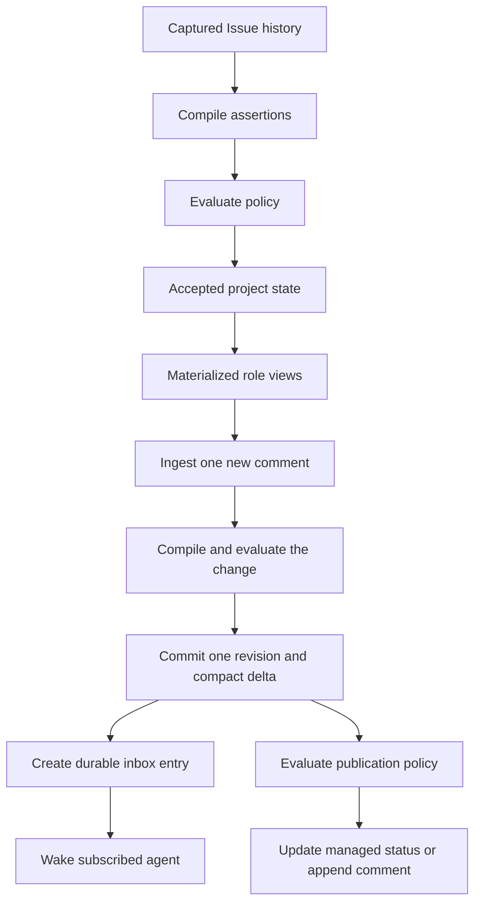
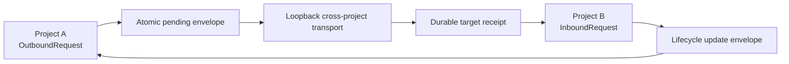

# First release plan

Status: draft

This document owns the scope and acceptance criteria for Merl's first release. The [product description](product-description.md), [user interface and behavior contract](user-interface.md), and [architecture](architecture.md) should remain useful after this release ships.

## Goal

The first release must prove that Merl can reconstruct useful project state from a difficult GitHub history, preserve the evidence behind that state, and deliver one new change to an agent without sending the full thread again.

The proof uses one historical GitHub Issue with research discussion, stale claims, decisions, open questions, and linked artifacts. A second fixture exercises pull request findings and review rounds. The evaluation corpus also includes research traces with conflicting evidence.

The release runs one local project authority backed by SQLite. Its IDs, commands, and storage interfaces must preserve the path to shared and multi-repository projects without making remote deployment part of this release.

## Evaluation corpus

Before compiler implementation, maintainers will freeze 10 to 30 representative Issues, pull requests, and research traces. The corpus should contain:

- long discussions with stale or superseded statements
- explicit human decisions and later corrections
- review findings that close and reopen
- hypotheses tested by experiments
- conflicting evidence and ambiguous source text

Each fixture includes a human-reviewed expected state: active decisions, requirements, questions, facts, blockers, findings, hypotheses, claims, and next actions. Fixtures retain the captured source so every compiler version runs against the same input.

## End-to-end slice

The slice exercises every authoritative layer:

1. Capture the Issue description and comments as immutable source events.
2. Run a versioned compiler and store its assertions.
3. Evaluate those assertions against a recorded project revision.
4. Commit accepted decisions, questions, facts, and research objects.
5. Render distinct researcher and engineer views.
6. Ingest one new comment and advance the project by one revision.
7. Create a durable inbox entry and deliver the compact delta after wake-up.
8. Apply deterministic publication policy after commit and update GitHub without reingesting the projection as new meaning.

The same fixture must run from an empty database to prove replayability.

## Local cross-project proof

The release also hosts two local projects under one Merl process while preserving their authority boundary:

The proof attaches one provider repository to both projects through separate source bindings. Each binding has its own selectors, capabilities, and cursor. Project A then submits a versioned request to Project B with a pinned export. Project B accepts it, creates target-owned work, and reports progress without either project writing the other's state.

## Deliverables

The Issue is the first vertical slice. The full release also applies the pipeline to pull request descriptions, comments, reviews, findings, and status changes.

The release includes:

- a Rust workspace and SQLite schema
- explicit Project, ProjectSource, Repository, and ProjectSourceBinding identities
- automatic provider repository discovery with no committed Merl marker
- forward-only migrations and projection rebuild support
- immutable source capture for GitHub Issues, pull requests, comments, and reviews
- versioned compilation runs and stored assertions
- batch policy evaluation against a basis revision
- accepted domain events and materialized objects
- idempotent semantic commands processed by the local authority
- compact researcher and engineer views
- project deltas and object expansion
- durable inbox entries, acknowledgement, and wake-up retry
- durable agent profiles, scoped guidance, checkpoints, and bounded resume views
- configurable continuous, task-scoped, and manual context policies
- durable session closure followed by retryable host-context reset
- session-scoped model, effort, capability, availability, and relative-cost advertisements
- task requirements and explainable manual candidate ranking
- human-approved agent templates and bounded PM provisioning
- durable spawn requests, host attempts, readiness, drain, and stop state
- secret-free node export and import with stable logical agent and command IDs
- verified local-project export and exclusive authority takeover
- workspace recipes with dirty and unpushed work warnings
- managed Git worktrees with one writable workspace and task branch per assignment
- full-clone fallback and enforced read-only review workspaces
- owned scratch that is disk-backed by default, workspace storage reservations, and safe cleanup
- node and workspace storage accounting with configurable watermarks
- deterministic `none`, `status`, and `comment` publication decisions
- one bounded managed status projection per tracked Issue or pull request
- append-only comment publications and retryable publication attempts
- projection loop prevention and drift detection
- directional ProjectLinks and small versioned request contracts
- separate OutboundRequest and InboundRequest aggregates
- independent commitment, scheduling, and execution state for tasks and inbound requests
- deferral reasons and review triggers without implied delivery promises
- atomic cross-project envelopes and idempotent durable receipts
- live, revision-pinned, and snapshot export references
- loopback cross-project delivery between local projects
- a CLI for ingestion, replay, views, deltas, and inbox operations
- executable Gherkin scenarios for the first-release behaviors
- a behavior driver that tests public actions and results without reading storage internals
- evaluation reports for correctness and total token cost

## Acceptance criteria

The release is ready when:

- repeated ingestion produces no duplicate source or domain events;
- retrying one command ID never applies its operation twice;
- a command ID reused with another payload is rejected;
- one repository can feed two projects through independent bindings;
- binding selectors do not grant source or publication capabilities;
- a repository rename preserves its provider-backed identity;
- an outbound request transition cannot commit without its pending envelope;
- a target persists an authenticated envelope before acknowledging delivery;
- duplicate envelopes or origin transitions do not duplicate target work;
- target acceptance, priority, ownership, and implementation remain target-owned;
- receipt, acknowledgement, deferral, and review dates never imply accepted responsibility;
- accepted-but-deferred work remains distinct from pending-and-deferred work;
- requester need dates remain distinct from owner target dates;
- deferred work leaves an agent's actionable queue without disappearing from project state;
- active work cannot be deferred without an explicit pause transition;
- clearing an agent process or model context preserves active guidance and checkpoints;
- session resume combines relevant guidance with current accepted project state rather than restoring stale prose;
- a task-scoped reset occurs only after session outcome, checkpoint, cursor, assignment, and lease transitions commit;
- an unrelated task starts in a new context generation with active guidance but no prior task transcript;
- continuous policy does not reset context merely because one task completed;
- unsupported or failed host reset remains visible and never reports success;
- evaluation reports token use and task correctness for sequential unrelated tasks with and without task-scoped reset;
- model and effort changes create new session advertisements without changing logical agent identity;
- every advertised field exposes its source and observation time;
- stale or unavailable sessions are excluded from new task candidates;
- candidate ranking never selects an agent that misses a hard task requirement;
- cost preference ranks the cheaper runtime only when all hard requirements are met;
- committing an assignment records the requirements, advertisement, policy, and rationale used;
- runtime advertisement grants no membership, repository access, or task authority;
- a PM can spawn only templates, runtimes, permissions, and concurrency allowed by human delegation;
- Merl reserves workspace and scratch capacity before invoking the host;
- host failure or an ambiguous response cannot produce a duplicate or falsely available agent;
- draining an agent prevents new assignments while preserving active work for checkpoint;
- concurrent writers in one repository receive different working trees, indexes, and branches;
- path aliases and symbolic links cannot bypass writable-workspace collision checks;
- a reviewer does not share a writer's live checkout;
- read-only agents share an immutable checkout only when the host enforces read-only access;
- worktree cleanup refuses dirty, untracked, or unpreserved work;
- two worktrees may share one Git object store without sharing workspace ownership;
- managed agent processes use Merl-owned scratch instead of the system `/tmp`;
- memory-backed scratch is reported and may be rejected by policy;
- storage exhaustion rejects provisioning before a host process starts;
- cleanup waits for processes and leases, stays inside owned roots, and preserves protected data;
- a default node export contains no credential values, caches, logs, source bodies, or workspace contents;
- node export and import preserve logical agent and pending command IDs while creating a new node ID;
- dirty or unpushed workspace content is reported as not preserved;
- a local-project archive reproduces its accepted revision and pending outboxes before the new authority accepts writes;
- importing a local project cannot leave two authority generations able to accept mutations;
- a repeated project in correlation lineage does not by itself fail delivery;
- ingesting a derived target artifact does not create another origin request;
- projection rebuild produces the same accepted state;
- a crash cannot expose domain events without the matching revision and inbox entries;
- a failed wake-up leaves a pending inbox entry that the dispatcher retries;
- duplicate delivery does not make an agent process an inbox entry twice;
- routine state changes produce no GitHub comment;
- one significant accepted batch produces at most one readable comment per target;
- removing Merl IDs from generated prose leaves its meaning intact;
- repeated status changes stay within configured character and item limits;
- a GitHub failure leaves accepted state intact and a retryable publication record;
- an ambiguous publication failure reconciles before retry;
- reingesting or manually editing a managed projection creates no semantic assertion;
- every rendered object can expand to its assertion, compilation run, and captured source;
- replay or evaluation runs cannot change accepted state without promotion;
- first-release scenarios in the UI behavior contract pass through the CLI driver;
- those scenarios make no assertions against private Rust APIs or SQLite tables;
- researcher and engineer views answer the corpus questions at least as accurately as raw history;
- the measured token report includes compilation, views, expansions, clarification, and correction costs.

A compact view only counts as an improvement when agents still reach the right conclusion.

## Deferred work

The first release does not require:

- remote or multi-host authority deployment
- network transport between separate project authorities
- a distributed database or event broker
- a learned symbolic communication codec
- a broad MCP tool surface
- webhook hosting
- model-backed publication classification or rendering
- automatic authority for consequential agent interpretations
- interactive login and remote identity enrollment
- encrypted credential or secret migration
- automatic assignment optimization or learned competence scoring
- live provider pricing and billing integration
- portable hard quotas or cgroup-based resource enforcement

These exclusions reduce implementation scope without changing the architecture.
