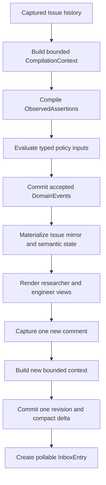

# First release plan

Status: draft

This document owns the scope and acceptance criteria for Merl's first release. The [product description](product-description.md), [user interface and behavior contract](user-interface.md), and [architecture](architecture.md) describe the larger product.

## Goal

The first release tests Merl's central claim: after repeated reads, agents can use compact state as accurately as the original GitHub thread and spend fewer tokens overall.

The proof starts with a historical Issue that contains stale claims, corrections, decisions, open questions, research discussion, and linked artifacts. Merl reconstructs its current state, ingests one new comment, and gives two agent roles only the resulting delta. Every rendered fact remains traceable to its derivation input.

One local Rust authority and SQLite database are enough. This release does not try to operate an agent team or coordinate several projects.

## Evaluation corpus

Before compiler work begins, maintainers freeze 10 to 30 complete Issue histories and divide them into three sets:

- a development set for ontology, prompt, rule, and policy work;
- a held-out set that remains unseen until a release candidate is ready;
- an adversarial set with edits, deletions, contradictions, quotations, ambiguous references, agent-generated prose, and sensitive-content removal.

The split happens by complete thread or project. Comments from one thread never appear in both development and held-out sets. Held-out and adversarial results may guide the release decision, but they do not become tuning data. If maintainers tune against a revealed case, they move it into development and replace it before the next claimed held-out result.

Each fixture has a human-reviewed expected state covering active decisions, requirements, questions, facts, blockers, findings, hypotheses, claims, and next actions. Two people independently label part of the held-out set. The corpus retains disagreements instead of forcing false certainty, then records an adjudicated result where the benchmark needs one expected answer.

Evaluation reports task correctness, provenance accuracy, stale-state errors, missed blockers, context expansion, clarification, and total token cost. Token accounting includes compilation, context construction, views, source expansion, corrections, and retries.

Reports lead with the break-even point, not the compression ratio. They cover one agent reading once, two agents revisiting the Issue, and a larger team returning many times. Merl may cost more for a single read and still prove useful for repeated work.

## End-to-end slice

The slice performs these actions:

1. Capture one Issue description, its comments, and edits as immutable source metadata with separately erasable content.
2. Build a bounded compiler context from current Issue state, relevant unresolved objects, a small conversational window, and the new source event.
3. Record the exact context manifest, renderer version, selection policy, object revisions, and rendered-input hash.
4. Store the compiler's assertions without granting them authority.
5. Evaluate assertions or explicit semantic commands as typed policy inputs.
6. Commit accepted events, the next project revision, materialized objects, and inbox entries atomically.
7. Render compact researcher and engineer views with expansion to available evidence.
8. Ingest one new comment and expose only its accepted delta through a pollable inbox.
9. Rebuild the same state from an empty database.
10. Run the held-out benchmark and publish the correctness and break-even results.

The compiler may ask for more context when a phrase such as "the issue above" remains ambiguous. It must not guess or silently fall back to the whole thread.

## Deliverables

The release includes:

- a Rust workspace with automated formatting, linting, tests, and SQLite migrations;
- one local project authority with serialized accepted writes;
- GitHub Issue identity and immutable capture of descriptions, comments, and edits;
- separate provider-owned Issue facts and Merl-owned semantic state;
- content-addressed protected payloads with audited administrative purge and tombstones;
- versioned `CompilationContext`, `CompilationRun`, and `ObservedAssertion` records;
- typed policy inputs for assertions and direct semantic commands;
- deterministic policy evaluation with recorded read dependencies and write sets;
- append-only domain events, project revisions, and rebuildable projections;
- compact researcher and engineer views;
- object and source expansion, including an explicit unavailable result after purge;
- project deltas and a minimal pollable inbox with acknowledgement;
- CLI commands for capture, compilation, review, correction, views, expansion, replay, purge, and evaluation;
- development, held-out, and adversarial evaluation sets;
- a benchmark report covering correctness and token break-even;
- executable behavior tests that use public interfaces rather than database tables.

Processes with unrestricted access as the same OS user can bypass Merl's policy API and read its files. The first release treats them as trusted at that boundary. Merl permissions provide governance and audit inside the application; they are not a sandbox.

## Acceptance criteria

The release is ready when:

- repeated ingestion creates no duplicate source records or accepted effects;
- an edit creates a new source capture linked to the prior version;
- a compilation run records every source event, object revision, recent-event window, selection rule, renderer version, and input hash it used;
- rebuilding a recorded compiler input produces the same bytes;
- an ambiguous reference produces an explicit context request or unresolved assertion instead of an invented meaning;
- the compiler does not need the full Issue history to process the selected incremental fixtures;
- direct commands reach policy evaluation without fabricated source events or compilation runs;
- every accepted object expands to its policy evaluation and typed derivation inputs;
- extracted objects also expand through their assertions and compilation runs to available source content;
- GitHub owns mirrored fields such as open or closed state, labels, and provider timestamps;
- Merl owns derived fields such as requirements, blockers, decisions, and research claims;
- a Merl command cannot report a provider-owned field changed until GitHub reports that change;
- policy evaluation records object, relation, collection, or predicate dependencies that affected its decision;
- an unrelated project revision does not require recompilation and does not invalidate an evaluation whose dependencies remain unchanged;
- a changed dependency or write conflict forces reevaluation or returns a conflict;
- accepted events, projections, the project revision, and inbox entries commit atomically;
- replay from an empty database produces the same accepted state and role views;
- a source-content purge removes retained source bytes and protected derived copies within its authorized scope, preserves audit tombstones and digests, and marks dependent evidence unavailable;
- purge never claims that affected state remains fully replayable;
- the local CLI states that same-user filesystem access lies outside Merl's enforcement boundary;
- researcher and engineer views answer held-out questions at least as accurately as raw history;
- benchmark results report disagreements and failures rather than scoring ambiguous cases as automatic successes;
- token reports include context selection, compilation, views, expansions, retries, clarification, and correction;
- benchmark results show the measured read count at which Merl costs fewer tokens than repeated raw-history consumption;
- behavior scenarios pass through the CLI driver without reading private Rust APIs or SQLite tables.

A smaller view counts as an improvement only when agents still reach the right conclusion.

## Deferred work

The first release excludes:

- pull request semantic compilation;
- live GitHub publication, managed status comments, and publication-slot ownership;
- background wake-up and host activation;
- agent profiles, durable guidance, context reset, advertisements, ranking, spawning, drain, and stop;
- managed worktrees, scratch quotas, and workspace cleanup;
- node export, project transfer, and interactive login;
- shared or remote authorities;
- repositories bound to several active projects;
- cross-project links, requests, exports, and transport;
- model-backed publication or policy classification;
- automatic authority for consequential model interpretations;
- MCP and graphical interfaces;
- release automation and curl installation.

These capabilities remain part of the product architecture. They enter release planning only after the Issue benchmark supports Merl's central claim.
