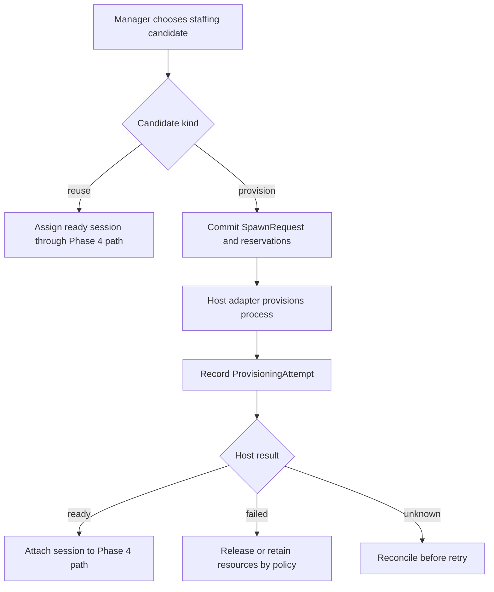

# Delegated agent management

Status: draft

This document owns the scope and acceptance criteria for Phase 5. It builds on [single-project agent operations](single-project-agent-operations.md).

## Goal

Phase 5 lets an authorized project manager staff work without asking a human to start every process. Humans define the allowed agent templates, budgets, permissions, and concurrency. A manager operates inside those limits.

The phase reuses Phase 4 identity, assignment, workspace, context, inbox, and checkpoint paths. Provisioning ends by attaching a ready host session to that existing path.

## Boundary

Phase 5 adds:

- approved agent templates and delegation grants;
- session runtime advertisements;
- staffing requirements for Tasks;
- explainable eligibility and ranking;
- durable spawn requests and provisioning attempts;
- host provisioning and process-control adapters with reconciliation after uncertain results;
- concurrency, cost, workspace, and storage reservations;
- manager-initiated drain, stop, and urgent interrupt;
- measured staffing outcomes.

It does not let a project manager change templates, widen permissions, reveal credentials, or exceed a human-approved budget.

## Staffing requirements

Tasks may state what kind of runtime can perform them:

- required capabilities and source access;
- minimum reasoning demand and risk class;
- required review path;
- budget preference and concurrency constraints.

These are staffing requirements. Product requirements, decisions, contracts, and blockers remain accepted project knowledge and already appear in Phase 4 assignment context.

Each active session advertises its provider, model, effort, capabilities, availability, context-reset support, and relative cost. Merl records whether each field came from the host, an operator, or the agent itself. A self-reported capability never becomes an authenticated permission.

Staffing considers two kinds of candidate:

- A reuse candidate is an already-ready `AgentSession`. Its current advertisement supplies observed runtime capability, availability, and cost.
- A provision candidate is an allowed `AgentTemplate` version. It describes the bounds within which Merl may ask a host to create a session.

Merl never presents a template declaration as a host-attested runtime advertisement. A provision candidate remains potential capacity until the host reports a ready session with its own advertisement.

Eligibility runs against the evidence each candidate kind can provide. The combined result tags every candidate as `reuse` or `provision` and explains exclusions and tradeoffs. A cost preference may choose the least expensive eligible option; it cannot waive a hard capability or review requirement.

## Templates and delegation

An `AgentTemplate` records one approved envelope for provisioning:

- role and allowed projects;
- host adapter and model or effort bounds;
- permissions and credential references;
- context and workspace policies;
- concurrency and relative cost limits;
- scratch and storage allowances.

Templates contain credential references rather than secret values. A human or another actor with delegation authority grants a manager permission to use named template versions within a smaller concurrency or spending limit.

Changing a template or delegation requires the same authority as creating it. A manager cannot derive a broader template from a narrow grant.

## Provisioning



A reuse candidate needs no spawn request. The authorized staffing decision creates or updates the Assignment, and the ready session acquires its Phase 4 execution lease.

For a provision candidate, the authority commits the spawn request and resource reservations before it calls the host. The accepted transition creates or selects a logical agent and durable Assignment, then prepares its Phase 4 workspace. The host worker runs after commit. A ready response records a new session advertisement and lets that session acquire the existing Assignment and workspace leases.

A duplicate spawn ID returns the original result. If the host times out after starting a process, Merl reconciles the external handle before retrying. It does not start a second worker because the first response was ambiguous.

The agent becomes available only after the host reports a ready session. Provisioning intent, host delivery, process readiness, assignment activation, and agent availability remain separate states.

## Resource limits

Merl reserves scarce resources before provisioning:

- one template concurrency slot;
- project or manager active-agent allowance;
- workspace storage and scratch allowance;
- a declared cost or token budget when configured.

Reservations have stable identities and survive restart. The authority releases them after confirmed process exit and safe workspace disposition. A failed host request cannot leak a concurrency slot forever; a janitor may reconcile expired reservations through recorded policy.

The first implementation may use relative cost classes where providers do not expose comparable prices. Merl keeps raw usage and pricing provenance when exact accounting is available.

## Drain, stop, and interrupt

Draining prevents new assignments and lets the agent checkpoint active work. Stopping requests session closure and waits for the host to confirm process exit before releasing leases and reservations.

An urgent interrupt still starts with durable state:

```text
Task T53: cancellation_requested
Session S18: interrupt_requested
HostAction HA91: pending
```

The host worker attempts the action after commit. Interrupt requested, host delivery, process exit, Task cancellation, and workspace release are different facts. A failed delivery leaves `HA91` pending and retryable.

Host actions target an adapter-issued session handle with process-start identity. Merl never treats a PID alone as durable identity.

## Deliverables

Phase 5 includes:

- versioned agent templates and human-controlled delegation grants;
- durable runtime advertisements with provenance and expiry;
- Task staffing requirements and explainable ranking across reuse and provision candidates;
- idempotent spawn requests, provisioning attempts, and reconciliation;
- host adapter contracts for provision, inspect, interrupt, and stop, extending the Phase 4 attach, wake, and reset boundary;
- resource reservations and enforcement of delegated limits;
- drain, stop, urgent interrupt, and confirmed release paths;
- staffing and usage outcome history;
- a CLI-only scenario in which a PM provisions and completes work through approved templates.

## Acceptance criteria

Phase 5 is complete when:

- only an authorized human can create or widen a template or delegation;
- a manager can use only granted template versions and cannot select unapproved credentials;
- candidate selection distinguishes ready-session reuse from template-backed provisioning;
- a reuse candidate is rejected when its advertisement misses a hard capability, access, reasoning, or review requirement;
- a provision candidate is rejected when its template bounds cannot produce an eligible runtime;
- template declarations never appear as host-attested session capabilities;
- every candidate result explains its kind, eligibility, ranking, evidence provenance, and policy version;
- a manager can choose a candidate without granting it new project authority;
- choosing an eligible reuse candidate activates the Phase 4 path without creating a SpawnRequest;
- an accepted spawn reserves concurrency, workspace storage, and configured budget before host execution;
- retrying one spawn ID cannot start two agents;
- an ambiguous host response is reconciled before another provisioning attempt;
- a failed provisioning attempt does not mark an agent ready or activate its assignment;
- a ready session enters the same assignment, workspace, resume, and inbox path proven in Phase 4;
- the manager cannot exceed its active-agent or cost allowance;
- draining blocks new work while preserving active checkpoint and handoff behavior;
- stopping releases reservations only after confirmed process exit and safe workspace disposition;
- urgent interrupt remains auditable and retryable after delivery failure;
- authority restart recovers pending provisioning and host actions without duplicating side effects;
- staffing history retains the requirements, advertisement, selection reason, measured usage, and Task outcome;
- the acceptance scenario runs through public CLI commands without private database access.

## Acceptance scenario

1. A human creates two templates with different model, cost, and concurrency limits.
2. The human delegates limited use of both templates to a PM, while one compatible session is already ready.
3. The PM records staffing requirements and sees the ready session as a reuse candidate and each allowed template as a separate provision candidate.
4. The PM assigns one Task to the reuse candidate without creating a spawn request.
5. For a second Task, the PM chooses a provision candidate and submits a spawn request.
6. Merl reserves resources, prepares the durable Assignment and workspace, provisions the process, and grants the ready session its execution lease.
7. The worker resumes, completes the Task, checkpoints, and closes.
8. The PM drains another worker and issues an urgent stop after the drain cannot finish.
9. A simulated host-delivery failure survives restart and later completes without duplicating the process or losing the pending action.
10. Merl reports candidate kind, selection reason, resource use, context cost, and Task outcome.

## Deferred work

Phase 5 remains local to one project authority. It excludes:

- shared or remote authorities;
- cross-project requests, links, exports, and transport;
- node export and verified authority transfer;
- automatic organization-wide scheduling;
- graphical fleet administration.

Those features need separate plans and threat models.
