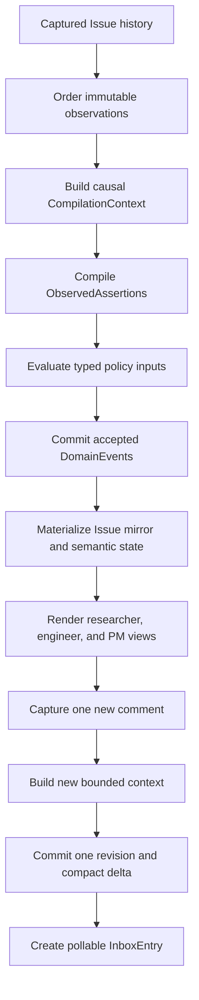

# First release plan

Status: draft

This document owns the scope and acceptance criteria for Merl's first release. The [roadmap](../roadmap.md) places it in the release sequence. The [product description](../product-description.md), [user interface and behavior contract](../user-interface.md), and [architecture](../architecture.md) describe the larger product.

## Goal

The first release tests Merl's central claim: after repeated reads, agents can use compact state as accurately as the original GitHub thread and spend fewer tokens overall.

The proof starts with a historical Issue that contains stale claims, corrections, decisions, open questions, research discussion, and linked artifacts. Merl reconstructs its current state, ingests one new comment, and gives two agent roles only the resulting delta. Every rendered fact remains traceable to its derivation input.

One local Rust authority and SQLite database are enough. This release does not try to operate an agent team or coordinate several projects.

## Implementation order

Before product code, the repository gets its build and release machinery:

1. GitHub Actions runs formatting, linting, tests, and documentation checks on every pull request and protected-branch push.
2. Release Please maintains a release pull request from conventional commits and creates a tag and GitHub release only after that pull request merges with required checks passing.
3. Corpus, schema, compiler, policy, views, inbox, and benchmark work follow under those checks.

This order makes the build and release contract visible from the first Rust change. Curl installation remains deferred until Merl produces an installable artifact.

## Evaluation corpus

The [benchmark harness](../evaluation/benchmark-harness.md) runs the five-method comparison and enforces the held-out gate. [Evaluation corpus](../evaluation/evaluation-corpus.md) describes the visible corpus and the sealed material. Held-out v3 is an archive, not a runnable evaluation set.

Before the evaluator builds v4, we finish the visible benchmark and test every first-release promise that does not need held-out results. If Merl cannot complete a promised workflow through its public interface, we fix it or remove that promise from the release. We then freeze Merl, the corpus format, and the harness. The evaluator builds and reviews v4 from the selected sources against that frozen contract. Only v4 supports the release claim.

Before compiler work begins, maintainers freeze 10 to 30 complete Issue histories and divide them into three sets:

- a development set for ontology, prompt, rule, and policy work;
- a held-out set that remains unseen until a release candidate is ready;
- an adversarial set with edits, deletions, contradictions, quotations, ambiguous references, agent-generated prose, and sensitive-content removal.

The split happens by complete thread or project. Comments from one thread never appear in both development and held-out sets. Held-out and adversarial results may guide the release decision, but they do not become tuning data. If maintainers tune against a revealed case, they move it into development and replace it before the next claimed held-out result.

Each fixture has a human-reviewed expected state covering active decisions, requirements, questions, facts, blockers, findings, hypotheses, claims, and next actions. Two people independently label part of the held-out set. The corpus retains disagreements instead of forcing false certainty, then records an adjudicated result where the benchmark needs one expected answer.

Evaluation reports task correctness, provenance accuracy, stale-state errors, missed blockers, context expansion, clarification, and total token cost. Token accounting includes compilation, context construction, views, source expansion, corrections, and retries.

Reports lead with the break-even point, not the compression ratio. They compare full raw history, a rolling summary, recent-window retrieval with search, summary plus retrieval, and Merl's materialized state with expansion. They cover one agent reading once, two agents revisiting the Issue, and a larger team returning many times. Merl may cost more for a single read and still prove useful for repeated work.

Each comparison records the model and version, reasoning effort, system and task prompts, tool access, and sampling controls. Paired repeated trials expose variance instead of treating one model response as a stable measurement.

## End-to-end slice

The slice performs these actions:

1. Capture one Issue description, its comments, and edits as immutable source metadata with separately erasable content.
   An offline fixture may contain only the provider's terminal Issue snapshot. In that case, Merl records the snapshot at capture time; it does not invent earlier provider-state transitions.
2. Replay those observations sequentially. Build each bounded compiler context from state available at its `interpretation_basis_revision`, a recent source window ending at `source_observation_cutoff`, relevant unresolved objects, and the triggering event.
3. Record the exact context manifest, cutoff, renderer version, selection policy, object revisions, rendered-input hash, and input and output budgets.
4. Validate a bounded structured compiler response, then store its assertions without granting them authority.
5. Evaluate assertions or explicit semantic commands as typed policy inputs.
6. Commit accepted events, the next project revision, materialized objects, and inbox entries atomically.
7. Render compact researcher, engineer, and PM views with optional object focus, expansion to available evidence, and scoped semantic-coverage metadata.
8. Ingest one new comment and expose only its accepted delta through a pollable inbox.
9. Rebuild the same state from an empty database.
10. Finish the visible development and adversarial trials, then exercise the whole release through public commands. Fix any missing workflow or remove it from the release. Once no product gaps remain, freeze Merl, the corpus format, and the harness. An independent evaluator then builds and reviews held-out v4. Close #24, freeze the exact candidate and evaluation settings, and run #32. That run compares Merl with the four simpler methods and reports correctness, provenance, failures, break-even, and variance. The final audit records the release decision; it does not change the candidate that was tested.

The compiler may ask for more context when a phrase such as "the issue above" remains ambiguous. It must not guess or silently fall back to the whole thread.

## Deliverables

The release includes:

- GitHub Actions CI for formatting, linting, tests, and documentation checks;
- Release Please configuration for conventional-commit release pull requests, tags, and GitHub releases;
- a Rust workspace with SQLite migrations and local commands equivalent to the CI checks;
- one local project authority with serialized accepted writes;
- GitHub Issue identity and public incremental capture of descriptions, comments, edits, and observed deletions;
- binding-scoped compilation mode and coverage requirement, with selected human Issue comments configured as `eager` and `required`;
- separate provider-owned Issue facts and Merl-owned semantic state;
- protected payloads with independent erasure scopes, audited administrative purge, and tombstones;
- versioned `CompilationContext`, `CompilationRun`, and `ObservedAssertion` records with source spans, assertion axes, and attribution;
- a bounded compiler-response protocol with typed output and explicit budget failures;
- typed policy inputs for assertions, direct semantic commands, and provider observations;
- durable project decision-author and command-actor grants, administered through the CLI;
- deterministic policy evaluation with recorded read dependencies and write sets;
- append-only domain events, project revisions, and rebuildable projections;
- evidence-impact records and support revalidation after source edits or deletions;
- compact, focusable researcher, engineer, and PM views with semantic-coverage and freshness metadata;
- object and source expansion, including an explicit unavailable result after purge;
- project deltas and a minimal pollable inbox with acknowledgement and paged access to large batches;
- CLI commands for capture, compilation, review, correction, views, expansion, replay, purge, and evaluation;
- hierarchical human and machine-readable help for the included commands, plus versioned JSON results and stable error codes;
- development, held-out, and adversarial evaluation sets;
- a benchmark report covering correctness and token break-even;
- executable behavior tests that use public interfaces rather than database tables.

Processes with unrestricted access as the same OS user can bypass Merl's policy API and read its files. The first release treats them as trusted at that boundary. Merl permissions provide governance and audit inside the application; they are not a sandbox.

## Acceptance criteria

The release is ready when:

- pull requests and protected-branch pushes run formatting, linting, tests, and documentation checks in GitHub Actions;
- CI uses least-privilege permissions, does not expose write credentials to untrusted fork jobs, and has documented equivalent local commands;
- conventional commits update a Release Please pull request, while tags and GitHub releases are created only after that pull request merges with required checks passing;
- repeated ingestion creates no duplicate source records or accepted effects;
- source capture records the effective compilation mode, coverage requirement, and policy version without placing payload text in an agent view;
- administrators can select Issue policy by source kind and trusted author class, inspect the winning selector, and manage binding-scoped overrides and account classifications; the [policy evidence record](compilation-policy-evidence.md) maps these obligations to public scenarios for #52;
- administrators can inspect and change binding defaults through the public CLI; version guards reject competing changes, retries preserve their outcomes, and accepted changes reach delta and inbox without rewriting earlier captures or dispatching historical work;
- structured commands and deterministic provider observations reach policy without a prose compiler;
- one compilation run is reused across role views and repeated visits while its source and context remain applicable;
- compiler responses enforce configured assertion, encoded-byte, output-token, context-request, expansion-round, and payload-text limits;
- the compiler protocol rejects undeclared prose, copied source text, and chain-of-thought, and an over-budget response creates no partial accepted assertions;
- generated Merl projections never enter compilation;
- an edit creates a new source capture linked to the prior version;
- source capture preserves Merl observation order and available provider creation, update, and version data;
- a compilation run records every source event, source-observation cutoff, interpretation-basis revision, object revision, recent-event window, selection rule, renderer version, and input hash it used;
- late on-demand compilation reconstructs context at the source's historical `interpretation_basis_revision`, while its policy evaluation uses current accepted state at a separately recorded `basis_project_revision`;
- historical bootstrap compiles observations sequentially and never exposes later source or accepted state to an earlier causal run;
- a fixture designed to reveal future leakage fails under noncausal context construction and passes under the recorded cutoff;
- incomplete historical version data produces an explicit hindsight run that cannot count as causal replay or enter accepted state without promotion;
- rebuilding a recorded compiler input produces the same bytes;
- an ambiguous reference produces an explicit context request or unresolved assertion instead of an invented meaning;
- context requests commit with their result, reserve one successor per round, and resume through `compilation expand` with the original compiler configuration and limits;
- expansion adds only named project objects or source versions at the original causal basis, keeps unavailable references visibly unresolved, and rejects repeated context or exhausted budgets without partial assertions;
- final assertions expose every contributing context round, and replay reconstructs that chain after restart;
- the compiler does not need the full Issue history to process the selected incremental fixtures;
- a caught-up required Issue view reports its observation head, contiguous processed cutoff, and no required compilation gaps;
- a view with required cold, pending, failed, purged, or excluded sources distinguishes "no accepted blocker" from a complete claim that no blocker exists;
- optional cold sources do not create coverage gaps, while structurally linked optional sources remain visible as expandable attachments;
- coverage requirement is selected without reading cold payload text, and only an authorized policy action can promote an optional source to required;
- live on-demand compiler work requires an accepted request for the same project, source version, run, compiler and version, executable configuration, model, prompt digest, and work limits before Merl records or dispatches it;
- direct commands reach policy evaluation without fabricated source events or compilation runs;
- decision, question, finding, hypothesis, claim, and task commands accept protected semantic content through the CLI under durable command authority;
- command content and supplemental notes commit with an immutable receipt; interrupted retries preserve that receipt, reject changed content, and cannot restore erased bytes;
- task requests, acceptance, deferral, start, and completion preserve independent commitment, scheduling, and execution, including `accepted + deferred + not_started` with a reason and review date;
- a structured command with supplemental prose records semantic lineage to the command, accepted batch, and affected objects; positive requests matching the subject, kind, and nonempty represented value reference are covered; same-subject requests with changed or absent values and different-subject requests of the same kind remain candidates for review;
- every accepted object expands to its policy evaluation and typed derivation inputs;
- extracted objects also expand through their assertions and compilation runs to available source content;
- one compound comment may yield several assertions with independent policy dispositions and precise source spans;
- typed compiler relations retain independent outcomes and exact endpoint bases; authorized review accepts grounded edges through relation events, and rebuild, focused views, expansion, and purge preserve their lineage;
- accepted compiler relations leave current graph use after source edits, deletions, or evidence erasure; durable relation impacts survive rebuild and upgrade, and authorized fresh acceptance or withdrawal closes stale support without rewriting semantic history;
- independent relation derivations retain separate evidence health while focused views count distinct neighbors;
- invalid or ungrounded relation endpoints reject only that relation while valid independent assertions remain applicable;
- public `source assertions` and `source apply` commands connect completed live compiler output to policy, one accepted revision, and one inbox batch without caller-supplied provenance;
- automatic decision-author acceptance is limited to direct, positive, reported `decision` directives with act `request`; other requests and quoted authority remain candidates;
- assertion application retries preserve recorded outcomes, new attempts deduplicate accepted run/index pairs, and concurrent grant or evidence changes cannot accept stale work;
- public candidate commands list and inspect durable interpretations, then accept, reject, or correct them under current command authority;
- review preserves the original compiler and policy records, stores reasons behind erasable payload references, and exposes replacement provenance through object history;
- review retries preserve their recorded outcome, resolved candidates cannot be accepted twice, and changed evidence, targets, or grants prevent stale acceptance;
- assertion speech act, epistemic basis, polarity, confidence, source author, assertion speaker, and attributed actor remain separate fields;
- quoted or relayed authority remains unverified unless it links to an authenticated original source;
- `unable_to_determine` remains a compiler outcome rather than a fabricated assertion;
- relative dates resolve from the recorded author time and timezone, while event-relative phrases remain object predicates;
- unresolved temporal values cannot enter accepted state through automatic policy or candidate acceptance; reviewed task deferrals retain their reason and date or event condition across rebuild and replay;
- source supersession leaves old assertions unchanged, appends evidence-impact records, and schedules dependent support for revalidation;
- accepted-object lifecycle/content and evidence-support status remain separate during revalidation and resolution; support-only effects preserve semantic revisions and erased payload references while advancing project revision and inbox;
- `project revalidation list` pages pending evidence impacts, and an authorized `run` reinterprets the recorded source set with current versions under the original limits;
- explicit `resolve` commands confirm, weaken, supersede, invalidate, or mark support unavailable through current policy, with immutable review receipts and atomic revision/delta/inbox updates;
- interrupted revalidation resumes saved input, exact review retries reuse recorded outcomes, concurrent evidence or grant changes reject stale work, and a later edit cannot reuse retired support;
- hindsight revalidation and its expansion successors remain separate from ordinary live semantic coverage;
- cosmetic and material edits exercise policy paths that respectively retain current support or supersede, weaken, or invalidate it;
- GitHub owns mirrored fields such as open or closed state, labels, and provider timestamps;
- live `issue capture` establishes a repository binding and durable capture policy, refreshes without duplicate versions or completed compiler work, and reports incomplete provider responses without inferring deletions;
- live eager bodies receive a causal compilation intent before execution regardless of coverage requirement; optional eager failures do not create required coverage gaps, while capture-only and on-demand sources stay cold;
- the offline corpus importer retains its fixed `fixture_import_v1` capture policy (`eager`, `required`) for every source version; live binding policy does not change fixture imports;
- Merl owns derived fields such as requirements, blockers, decisions, and research claims;
- a Merl command cannot report a provider-owned field changed until GitHub reports that change;
- a trusted provider observation follows deterministic policy, advances the same project revision as semantic changes, and appears through the same delta and inbox cursor;
- an administrator can list, grant, and revoke decision-author and command-actor authority through public commands; unauthorized attempts leave effective grants and accepted revision unchanged;
- policy entry points share durable grants and record their configuration digest; grant changes invalidate prepared work that depended on the old configuration;
- semantic grants survive restart and projection rebuild, and request retries preserve the original outcome without reapplying a revoked grant;
- policy evaluation records object, relation, collection, or predicate dependencies that affected its decision;
- an unrelated project revision does not require recompilation and does not invalidate an evaluation whose dependencies remain unchanged;
- a changed dependency or write conflict forces reevaluation or returns a conflict;
- accepted events, projections, the project revision, and inbox entries commit atomically;
- rebuilding disposable projections from accepted events, their referenced immutable typed policy inputs, provider observations, and sightings reproduces the same Issue state and role views without running a compiler;
- append-only structural records reject arbitrary user, source, and model prose and accept only bounded structural values or payload references;
- identical protected bytes in different retention scopes can be erased independently;
- a source-content purge follows derivations through later object-backed compiler contexts, removes their protected bytes from the active store, preserves audit tombstones and digests, and marks dependent evidence unavailable; no Merl-managed replica is configured in this release;
- purge output states that unmanaged backups, provider systems, and previously exported archives lie outside that guarantee;
- purge never claims that affected state remains fully replayable;
- the local CLI states that same-user filesystem access lies outside Merl's enforcement boundary;
- top-level help lists command groups, while one subcommand's human or JSON help can be loaded without rendering the full command catalog;
- every included command documents its arguments, outcomes, stable errors, examples, and related commands;
- non-interactive JSON output never prompts and preserves the same accepted, queued, candidate, rejected, and conflicted meanings as human output;
- researcher and engineer views answer held-out questions at least as accurately as raw history and the simpler summary and retrieval baselines; the PM view uses the same accepted state and coverage contract;
- benchmark results report disagreements and failures rather than scoring ambiguous cases as automatic successes;
- benchmark reports freeze model, effort, prompts, tool access, and sampling controls, and include paired repeated trials with variance;
- token reports include context selection, compilation, views, expansions, retries, clarification, and correction;
- benchmark results show the measured read count at which Merl costs fewer tokens than repeated raw-history consumption;
- behavior scenarios pass through the CLI driver without reading private Rust APIs or SQLite tables.

A smaller view counts as an improvement only when agents still reach the right conclusion.

## Deferred work

The first release excludes:

- pull request semantic compilation;
- live GitHub publication, managed status comments, and publication-slot ownership;
- background wake-up and host activation;
- agent profiles, durable guidance, context reset, advertisements, ranking, spawning, drain, and stop;
- managed worktrees, scratch quotas, and workspace cleanup;
- node export, project transfer, and interactive login;
- shared or remote authorities;
- repositories bound to several active projects;
- cross-project links, requests, exports, and transport;
- direct-message capture, delivery, and legacy mailbox migration;
- model-backed publication or policy classification;
- automatic authority for consequential model interpretations;
- graphical interfaces;
- packaged artifacts and curl installation.

These capabilities remain part of the product architecture. They enter release planning only after the Issue benchmark supports Merl's central claim.
