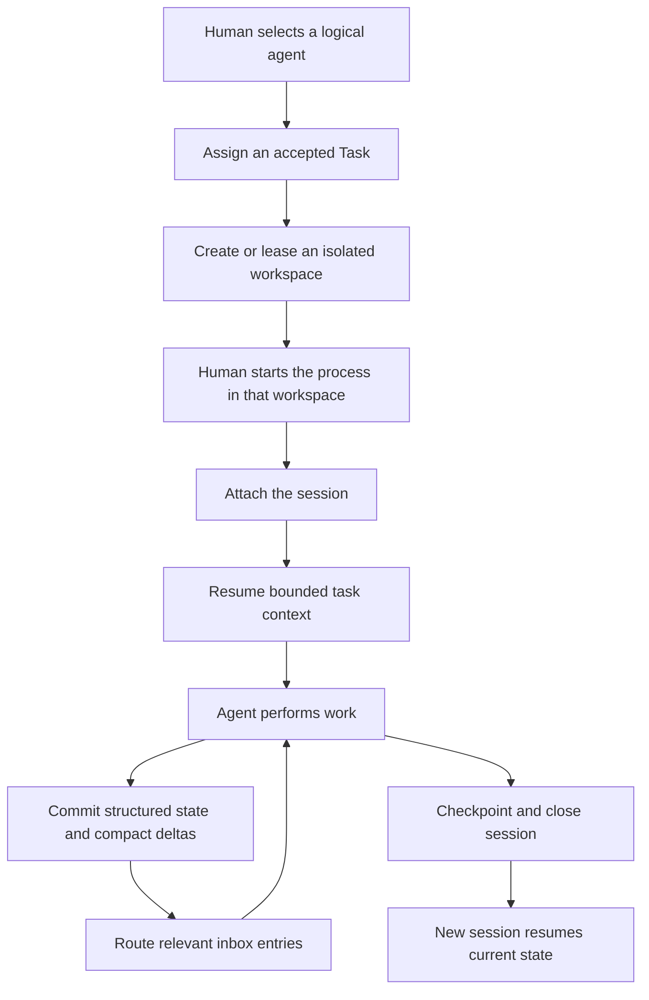

# Single-project agent operations

Status: draft

This document owns the scope and acceptance criteria for Phase 4. It follows the [first release](first-release.md) and precedes [delegated agent management](delegated-agent-management.md).

## Goal

Phase 4 makes Merl useful to a team of agents working in one project. A human attaches the repository once and chooses when to start each process. Merl keeps the selected project surfaces current, then prepares each agent's stable identity, accepted assignment, isolated workspace, and bounded project view before launch.

The phase tests a larger version of the original token claim: several agents should coordinate through current state and compact deltas instead of sending each other full histories or rebuilding context after every restart.

One local project authority is enough. The project may refer to more than one source, though the acceptance scenario uses one Git repository so synchronization and workspace behavior stay easy to inspect.

## Boundary

Phase 4 includes the operations needed after a human starts an agent:

- logical agent identity, project role, and durable guidance;
- session generations, checkpoints, and bounded resume;
- accepted tasks, assignments, execution leases, and handoffs;
- repository attachment, selective Issue and pull request synchronization, and durable source policy;
- managed worktrees, branches, scratch space, and safe cleanup;
- assignment-aware views and inbox delivery;
- structured work requests and optional direct prose;
- GitHub pull request capture, review state, and sparse publication;
- local daemon delivery and attached-host wake or reset;
- task-scoped context closure when the host supports it;
- context and token accounting for the team workflow.

Phase 4 does not let a manager create, drain, stop, or replace another agent. It does not rank runtimes or choose models. Those operations require templates and delegated authority, which belong to Phase 5.

## Operating model



The human chooses the model host. Merl prepares the workspace and bootstrap before the human starts it. The attached process receives one bootstrap line:

```text
Run `merl session resume --agent <id> --format json` before work; use `merl help <topic>` when needed.
```

Merl does not inject a command catalog or require a large agent skill. Durable guidance lives in the agent profile and appears in the resume projection when relevant.

## Agent identity and guidance

An `AgentProfile` names one logical agent across process exits, model changes, computers, and context resets. An `AgentSession` names one disposable context generation.

Project membership and role belong to durable policy. A runtime claim cannot grant either one. One active session owns the logical agent's actionable inbox lease. Other sessions may inspect state but cannot advance its cursor or execute its assignment.

Guidance has three forms:

- an instruction records behavior required by an authorized human or project policy;
- a practice records a working method adopted by the agent;
- a lesson records an observation proposed for later reuse.

Guidance keeps its scope, author, authority, provenance, priority, and lifecycle. Merl selects a bounded set during resume. It does not append an agent's memory transcript to every new context.

## Tasks, assignments, and handoffs

A Task remains knowledge-plane state. An Assignment connects one logical agent and session to that Task for a period of work.

Phase 4 supports direct assignment by an authorized human and self-claim where project policy allows it. It records assignment history rather than rewriting ownership in place. An execution lease prevents two sessions from acting as the same worker on one assignment.

The task keeps its independent planning facets:

| Facet | Question |
| --- | --- |
| Commitment | Has the owner accepted responsibility? |
| Scheduling | May the work proceed now? |
| Execution | What has happened while carrying it out? |

Deferring or pausing work removes it from the actionable queue without erasing the assignment history. Pausing in-progress work requires a checkpoint before Merl releases the execution lease.

A handoff references the Task, current project revision, relevant objects, artifacts, and an optional short note payload. The next agent receives current objects. It does not inherit a copied snapshot that can drift from accepted state.

## Repository synchronization

The first release captures one named Issue at a time. Phase 4 lets a human attach a repository once and records which parts of it Merl should maintain:

```bash
merl repository attach \
  --project project-a \
  --repository acme/project-a

merl repository sync --project project-a
```

The binding stores a versioned selection policy. It may include open Issues in an active milestone, selected labels, explicit Issue or pull request numbers, and provider objects referenced by accepted Tasks. A project can retain a closed Issue when current work still depends on it.

Selection begins with structural provider metadata. Merl does not read cold body text to decide whether that text deserves compilation. The sync worker may keep a cheap catalog of Issue and pull request identity, state, labels, milestone, assignees, and update time while capturing full source versions only for selected surfaces.

Capture and compilation remain separate. A practical policy might compile human comments on active assigned work eagerly, retain bot comments as `capture_only`, and leave an unrelated backlog uncaptured or catalog-only. Changing the policy requires an authorized operation and does not rewrite the policy recorded on earlier captures.

The local daemon runs bounded incremental sync, and the CLI can request it directly. Provider pagination, rate limits, and incomplete responses stay visible. An incomplete listing cannot imply that an Issue, comment, or pull request was deleted. Repeating a sync is idempotent and does not redispatch completed compiler work.

This is selective project maintenance, not an instruction to compile an entire repository. Sync reports what it cataloged, captured, compiled, skipped, or could not verify.

## Assignment context

Resume derives relevance from the active assignment. Role affects ordering after that selection.

The context contains, within a recorded budget:

1. identity, role, and active guidance;
2. the assigned Task and its planning state;
3. requirements, decisions, contracts, blockers, and findings connected to the Task;
4. the latest checkpoint and current versions of its references;
5. relevant accepted changes since the session cursor;
6. expandable references for omitted detail.

Relation kind and direction affect priority. A blocker should appear before an incidental mention. The response reports selector version, coverage scope, and truncation so an agent cannot mistake a bounded view for proof that no other state exists.

Phase 4 does not need staffing requirements such as preferred model, reasoning effort, or cost class. Those fields help Phase 5 choose among runtimes. Product requirements and review obligations that affect implementation are ordinary accepted project state and belong in the Phase 4 context.

## Workspaces

Every writable assignment gets an isolated workspace. The default local strategy uses one managed Git object store with a separate worktree and branch for each writer:

```text
~/.merl/
  git/<repository-id>.git/
  workspaces/<project>/<task>-<agent>/
```

The workspace record links the source, Task, Assignment, agent, session, path, Git identity, branch, base revision, access mode, creation time, and lease state.

Merl canonicalizes paths and inspects Git worktree identity before granting a lease. Two writers cannot hold leases for the same working tree. Review work uses a detached read-only worktree at a pinned commit unless the reviewer needs a separate writable branch.

Build output and temporary files remain workspace-local. Merl routes process scratch beneath a directory it owns and records the configured allowance. A full clone remains available when Git worktrees cannot provide the required isolation.

Workspace cleanup is conservative. Dirty files, unpreserved commits, active processes, or unpublished work block removal. Merl cleans only marked paths beneath its storage root. It never sweeps a user checkout or the system temporary directory.

A normal manual flow looks like this:

```bash
merl agent register project-a-dev --role engineer
merl task assign T52 --to project-a-dev --workspace auto
merl agent attach --agent project-a-dev --task T52
merl session resume --agent project-a-dev --format json
```

Assignment returns the workspace path, branch, and bootstrap line. The human starts the process in that path. Attach binds the external process to a new session and verifies that it is using the assigned workspace.

## Inbox and direct coordination

Assignment and subscription policy route reference-only inbox entries to agents. One accepted transition may fan out to several agents without copying source prose or recompiling for each recipient.

An active attached session may use the local daemon through `merl inbox watch`. A failed wake leaves the entry pending. Polling remains a complete fallback.

Most project work uses structured commands. If an engineer already knows that a Task is blocked, it records that state directly instead of writing prose for another model to extract.

Direct prose remains available for nuance:

```bash
merl task request --team software \
  --summary 'Review parser memory safety'

merl message send \
  --to project-a-reviewer \
  --ref T45 \
  --summary 'Please look at the unsafe block in the parser'
```

The Task is the schedulable state change. The note is immutable source evidence with separate delivery records. Its payload stays cold in ordinary views. Delivery and acknowledgement do not imply agreement, task acceptance, or completion.

## Pull requests and review

An agent team needs a path from workspace changes to review. Phase 4 extends the Issue source integration to pull requests, reviews, commits, and merge state.

GitHub remains authoritative for provider facts such as head commit, open or closed state, review submission, and merge result. Merl owns the interpreted intent, affected contracts, findings, blockers, and review obligations. Provider observations and semantic state share the project revision and inbox path without overwriting each other.

An engineer may publish its assignment branch through a structured command. The resulting pull request retains the Task, Assignment, workspace, branch, base revision, and accepted requirements that justified the change. A reviewer receives a detached read-only workspace at the reviewed commit and a focused view of intent, contract changes, findings, and test evidence.

Merl publishes sparingly. Routine cursor movement, checkpoints, and derived state remain internal. Publication policy may update one bounded status surface or append ordinary prose for a decision, changed requirement, serious blocker, or merge-blocking finding. GitHub writes happen after Merl commits accepted state and remain retryable after an ambiguous provider response.

## Session closure and resume

Before a session ends, Merl records a checkpoint with the understood project revision and references to current work. The checkpoint may carry a short summary payload, but current accepted state wins when that prose becomes stale.

```bash
merl session checkpoint \
  --agent project-a-dev \
  --ref T52 --ref B9 --ref D18

merl session close \
  --agent project-a-dev \
  --task T52 \
  --outcome completed
```

`continuous`, `task-scoped`, and `manual` context policies control closure behavior. A task-scoped close commits the checkpoint, outcome, cursor, assignment transition, and lease release before asking the host to clear context. If the host cannot reset context, Merl reports that fact and prints a manual next step.

A later session receives a new generation ID. Resume uses active guidance and current task state without replaying the prior transcript.

## Token evidence

Phase 4 measures the cost of operating a team rather than stopping at the size of a rendered view. Each assignment records, where the host makes the data available:

- resume and delta tokens;
- object and source expansions;
- direct-note payload reads;
- compiler work caused by agent prose;
- checkpoint and restart cost;
- model usage and task outcome.

The report compares Merl with a transcript-oriented workflow for the same scenario. It shows repeated context sent to several agents and the cost of restarting an agent on unfinished work.

## Deliverables

Phase 4 includes:

- agent profiles, project membership, roles, and durable guidance;
- repository attachment and versioned selection, capture, and compilation policies;
- bounded incremental synchronization for selected Issues and pull requests;
- session generations and one actionable inbox lease per logical agent;
- Task assignments, execution leases, pause, handoff, and assignment history;
- assignment-derived and relation-weighted project views;
- managed writable and read-only Git workspaces;
- workspace-local scratch routing and safe cleanup;
- session checkpoint, close, resume, and supported context reset;
- local daemon-backed inbox watch with polling fallback;
- structured work requests and optional cold direct messages;
- pull request capture, review-focused context, and provider-owned merge state;
- branch publication and sparse GitHub status or comment output;
- packaged local CLI and daemon artifacts with a documented install path;
- token and context accounting across agents and restarts;
- a CLI-only multi-agent behavior scenario.

## Acceptance criteria

Phase 4 is complete when:

- a human can attach an existing GitHub repository once and inspect its effective synchronization policy;
- repository sync discovers eligible Issues and pull requests from provider metadata without reading cold body text to make the selection;
- open, milestone, label, explicit-reference, and accepted-Task selectors have deterministic, versioned behavior;
- selected existing Issues capture their available descriptions, comments, edits, and provider facts;
- repeated sync creates no duplicate sources, accepted effects, or completed compiler work;
- incomplete provider responses do not invent deletions or claim a complete refresh;
- eager, on-demand, capture-only, required, and optional behavior follows the durable binding policy;
- unrelated backlog prose does not enter compilation merely because its repository is attached;
- logical agent identity survives process restart and model-context replacement;
- project role and membership come from durable policy rather than runtime claims;
- one active session owns a logical agent's actionable inbox cursor and execution lease;
- an authorized human can assign a Task, while an allowed agent can claim eligible work;
- assignment history survives reassignment, pause, deferral, completion, and cancellation;
- two agents assigned different Tasks receive different default context without supplying `--focus`;
- focus selection uses relation kind and direction, records its selector version, and reports truncation;
- session resume returns bounded guidance, assignment state, checkpoint references, relevant deltas, and current accepted objects;
- current accepted state overrides stale checkpoint prose;
- a new writable assignment receives a unique branch and worktree;
- two active writers cannot obtain leases for the same working tree;
- read-only review work cannot modify the writer's checkout;
- dirty files and unpreserved commits block automatic workspace removal;
- Merl never deletes an unmarked path or a path outside its managed storage root;
- structured agent actions reach policy without compiler extraction;
- one direct note creates one source event and several deliveries without recipient-specific compilation;
- raw note payloads stay out of ordinary inbox and assignment views until requested;
- acknowledgement records receipt or cursor movement without changing Task or semantic state;
- a missed wake leaves durable work discoverable through polling;
- publishing an assignment branch links the pull request to its Task, Assignment, workspace, and base revision;
- pull request capture keeps GitHub-owned facts separate from interpreted intent, findings, and blockers;
- a reviewer receives the reviewed commit in a separate read-only workspace;
- routine machine state stays out of GitHub while significant configured events produce bounded, retryable publication intents;
- an ambiguous GitHub write cannot duplicate a pull request, status update, or comment after reconciliation;
- task-scoped closure commits checkpoint and lease state before any host reset;
- unsupported host reset produces an honest pending or manual result;
- a restarted session can continue unfinished work without the previous transcript;
- the acceptance scenario runs through public CLI commands without private Rust or SQLite access;
- the report accounts for rendered context, expansions, restarts, and measured host usage where available.

## Acceptance scenario

The release scenario uses an existing GitHub repository plus a PM, an engineer, and a researcher that a human starts and attaches.

1. A human attaches the repository and selects its active milestone and agent-work labels.
2. Merl catalogs the repository, captures selected existing Issues, and leaves unrelated backlog prose out of compiler input.
3. A later sync records one new comment and one provider-state change without duplicating earlier work.
4. The PM assigns separate accepted Tasks to the engineer and researcher.
5. Merl creates an isolated writable worktree for each Task that needs repository access.
6. Each agent resumes into a different assignment-focused context.
7. The researcher records a finding that changes the engineer's Task.
8. The engineer receives a compact delta and expands only the finding and its evidence.
9. The engineer sends a supplemental note linked to a structured Task transition; Merl does not create duplicate work from that note.
10. The engineer publishes its assignment branch as a pull request.
11. A reviewer opens the reviewed commit in a separate read-only workspace and records a finding.
12. GitHub reports the final merge state through the project revision and inbox.
13. Both workers checkpoint and close.
14. Fresh sessions resume from current state and referenced objects without receiving the prior transcripts.
15. Merl reports the context and token cost for the team workflow.

## Deferred work

Phase 4 excludes:

- manager-selected agent templates and delegation grants;
- runtime capability and cost ranking;
- manager-initiated spawn, drain, stop, replacement, or scaling;
- host provisioning and ambiguous-spawn reconciliation;
- cross-project requests and transport;
- shared or remote project authorities;
- node export and project authority transfer.

The first four items belong to Phase 5. Later release plans will own the remaining product work.
