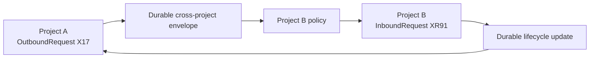

# Product description

## What Merl is

Merl gives a group of humans and agents a shared, durable understanding of a project. A Merl project may span several repositories, artifact stores, and experiment systems. Merl compiles activity from those sources into accepted project state, then sends each agent a small delta suited to its role.

Today, agents collaborate by rereading prose. A software engineer may need an entire issue thread to discover the current requirement. A reviewer may receive comments for findings that another revision has already fixed. A research agent may have to reconstruct which experiment weakened a hypothesis. Long-lived agents also lose useful context when their sessions end.

This costs tokens and produces mistakes. Summaries help for a while, but repeated summaries drift from their sources. Merl keeps the original evidence and derives typed state from it. Agents read the current state first, then retrieve the source when they need nuance.

## Who it is for

Merl is for teams that use several coding or research agents on the same project. A team might include a project lead, researchers, software engineers, and reviewers, with humans working through GitHub alongside them.

Merl does not require every participant to use the same model or agent host. Claude Code, Codex, shell scripts, CI jobs, and people can work against the same state through the CLI, whether the project authority is local or remote.

## Projects and sources

A Merl `Project` is the unit of accepted state, revision ordering, policy, and access control. A `ProjectSource` identifies outside material such as a repository, artifact store, or experiment system. `ProjectSourceBinding` connects a source to a project, so one project may use several sources and one source may feed several projects.

One project may attach two GitHub repositories, an artifact store, and an experiment system. A project-level decision can govern both repositories. An experiment can use commits from each repository, produce a dataset in the artifact store, and support a claim that belongs to the project rather than either codebase.

Each binding separates relevance, permission, and provider access. Selectors decide which source events matter to the project. Capabilities govern ingestion and publication. A credential reference tells Merl how to authenticate without turning a label or path filter into permission.

Merl discovers provider-backed repositories from their Git remotes and provider APIs. It keeps immutable provider identities separately from human-readable names. If a GitHub repository moves from `acme/api` to `acme/platform-api`, its provider repository ID still resolves to the same Merl `Repository`. Local sources can receive node-local identities through explicit attachment. Code repositories do not need committed Merl markers.

Provider facts and Merl interpretations stay separate. GitHub owns whether an Issue is open, which labels it carries, and whether a pull request merged. Merl owns derived requirements, blockers, decisions, findings, and research claims. Merl may request a provider action, but it waits for the provider to confirm the result.

## How it works

One project authority serializes accepted changes for each project. Merl processes activity through that authority in six layers.

1. A `SourceEvent` records what Merl observed. Its append-only metadata points to retained source content. An edited GitHub comment creates another source event instead of rewriting the first one.
2. A `CompilationContext` records the bounded state and recent conversation needed to understand the new source. It preserves `source_observation_cutoff`, historical `interpretation_basis_revision`, selected object revisions, renderer, and exact input digest.
3. A versioned `CompilationRun` interprets that context and emits `ObservedAssertion` records. A long comment or direct note may yield several assertions with separate source spans, speech acts, epistemic bases, polarity, confidence, and attribution.
4. A `PolicyEvaluation` considers typed inputs, including assertions and direct commands, together with accepted state at its own current `basis_project_revision`. It applies authority rules, detects conflicts, and records why each input was accepted, rejected, or held for review.
5. Accepted evaluations produce an atomic batch of `DomainEvent` records. The authority updates materialized state, advances the project revision once, and creates inbox entries for subscribed agents in the same transaction.
6. Merl renders the new state as role-specific views and deltas. Wake-up is best effort; the durable inbox remains correct if a process crashes or a host integration fails.

Every accepted object points back to its policy evaluation and derivation inputs. Extracted state also links through its assertion and compilation run to the source. Merl can replay available source content through a new compiler without changing the live project.

The compiler does not read one comment in isolation or reload the full thread each time. It receives Issue state as it existed at the recorded cutoff, relevant unresolved objects, a small recent window, and the triggering event. Historical import proceeds in source-observation order, so a comment cannot see later discussion. If the provider no longer exposes enough version history to reproduce that order, Merl labels the run as hindsight instead of presenting it as a causal replay.

Direct prose follows the same authority boundary. A human or agent message is immutable source evidence, not a state mutation. Delivery alone grants no authority. Compilation may derive several independent assertions, and policy may accept one while rejecting or holding another. Merl-generated notifications retain their origin and never return through semantic compilation.

Capture does not require compilation. Each source binding chooses a compilation mode of `capture_only`, `on_demand`, or `eager` and a separate coverage requirement of `required` or `optional`. Mode controls when extraction runs. Coverage requirement controls whether an unprocessed observation prevents a completeness claim. Routine agent notes and long artifacts can remain optional and cold until an authorized action needs their semantics. Human project comments are normally eager and required so accepted state does not knowingly lag the discussion. Structured commands and deterministic provider observations bypass prose extraction entirely.

Compilation belongs to the source inside a project, not to a recipient. Several deliveries and later sessions reuse the same applicable derivation. Raw uncompiled payloads stay out of ordinary views; an agent expands or compiles them explicitly when needed.

Compiling an old source later does not reinterpret it with facts learned afterward. The compilation context reconstructs accepted state and source history at the source's original causal position. Policy then evaluates the resulting assertions against current accepted state. Deliberate reinterpretation with later knowledge is labeled hindsight.

An accepted revision is not a claim that Merl has interpreted every required source. Views show semantic coverage beside accepted state: the source-observation head, the contiguous processed cutoff, and required sources that are cold, pending, failed, purged, or excluded. A negative answer such as "no accepted blocker" is qualified while required coverage is incomplete. Optional cold sources do not create gaps; explicit references and other structural metadata can still expose them as attachments without reading their payloads.

Structured actions may include an optional explanatory note. Merl records that note as supplemental source evidence and links it to the command, accepted batch, and affected objects. If the note is compiled later, the compiler sees what the structured action already represented and extracts only added evidence, constraints, corrections, or other acts. It does not create the same task or decision again.

Compiler responses are typed and deliberately small. A run has limits for assertions, encoded bytes, output tokens, context requests, expansion rounds, and new payload text. The ordinary response contains assertions, source spans, relations, confidence, attribution, or a structured request for more context. Essays, copied source text, and chain-of-thought are not part of the protocol. A response that exceeds its budget fails visibly rather than being silently truncated.

When a source is edited or deleted, Merl keeps the earlier assertion as a record of what the compiler inferred at the time. It marks the affected evidence for revalidation and runs the new source version through compilation and policy. The accepted object may remain active while its support is pending review; policy later confirms, weakens, supersedes, or invalidates it. This keeps an object's lifecycle separate from the health of its supporting evidence.

Provider-owned facts use the same accepted revision and delta path as Merl semantics. A trusted observation that GitHub closed an Issue passes through deterministic policy, updates the provider mirror, advances the project revision, and reaches subscribed agents without an LLM interpreting it.

## Project knowledge and agent operations

Merl separates two kinds of state because they have different lifetimes and consistency needs.

The knowledge plane contains the project's accepted knowledge and work:

- issues, pull requests, and tasks
- decisions, requirements, questions, and blockers
- facts, artifacts, findings, claims, and evidence
- hypotheses and experiments
- software contracts
- outbound and inbound cross-project requests

The control plane records how agents carry out that work:

- agents and assignments
- inbox entries and subscriptions
- cursors and acknowledgements
- leases and wait conditions
- checkpoints and handoffs
- agent profiles and durable guidance
- pending cross-project envelopes and delivery receipts

Control records refer to knowledge records rather than copying them. A task remains part of the project after an agent's lease expires. A session checkpoint records the project revision the agent understood and references the relevant tasks, decisions, and artifacts.

Some control state expires. Other records, including handoffs, assignment history, failed deliveries, and acknowledgements, remain available for recovery and diagnosis.

## Work requests and delays

A request for work and a promise to do it are different facts. Merl records three facets for tasks and other work-bearing objects:

- Commitment says whether the owning project has accepted responsibility: pending, accepted, or declined.
- Scheduling says whether accepted or pending work is unscheduled, deferred, or scheduled.
- Execution says whether work has started, is blocked, is complete, or was cancelled.

These facets do not collapse into one status. A project manager can accept a software task and defer it until capacity is available. The same manager can defer a pending request until the next planning review without accepting it. Every view shows commitment beside scheduling so `deferred` never implies a promise.

A requester may state `needed_by` and the impact of lateness. Those are constraints from the requester, not dates promised by the owner. A scheduled start or finish comes from the owner. If a review date or target schedule falls after `needed_by`, Merl exposes the mismatch rather than choosing a priority.

Deferral records a reason and either a review date or a condition for reconsideration. It keeps the task durable, removes it from the assigned agent's actionable queue, and notifies subscribers. Deferring work that is already in progress requires an explicit pause; a scheduling edit does not silently stop an agent.

## Concurrent work in one repository

Agents collaborate through tasks, accepted state, commits, and pull requests rather than by editing the same working directory. Each concurrent writable assignment receives its own workspace. On one computer, the default is a Git worktree with a unique task branch under `MERL_HOME`; the worktrees share Git objects but keep separate files, indexes, branches, and current directories.

A full clone is available when a repository does not support the worktree strategy or stronger isolation is required. Read-only agents use a detached worktree at a fixed commit by default. They may share one immutable checkout only when the host enforces read-only access; they do not share a writer's live checkout.

Merl records the agent, assignment, task, source, branch, base revision, and filesystem path for each workspace. It detects aliases and symbolic links before granting a writable lease. Finishing a task releases the lease only after Merl checks for dirty files and unpreserved commits. It never deletes or reuses uncertain work.

Each workspace also receives owned scratch, build, and cache locations. Merl points `TMPDIR` and compatible tool settings at those directories instead of the system `/tmp`. The scratch root defaults to `MERL_HOME/scratch`, can move through `MERL_SCRATCH`, and should live on disk. Merl warns when scratch resides on a memory-backed filesystem, where it can consume RAM and swap.

Node and workspace quotas reserve capacity before an agent starts. A janitor removes scratch after the owning processes exit and trims reconstructible caches to configured watermarks. It touches only directories Merl created and marked as owned. Source workspaces, dirty files, unpreserved commits, and durable artifacts do not enter scratch cleanup.

Separate worktrees prevent filesystem races; they do not prevent two tasks from changing the same code. Tasks may declare affected paths or components so Merl can warn the project manager about likely overlap. Git and pull-request review remain responsible for integration and conflict resolution.

## Cross-project collaboration

Multi-repository work stays inside one accepted project history. Cross-project work connects independently authoritative histories through requests and exports.

Each side owns a separate request aggregate. If Project A asks Project B for infrastructure, Project A owns an `OutboundRequest` describing its need and constraints. Project B imports that request as an `InboundRequest`, then decides whether to accept it and how to represent the work. Project A cannot assign Project B's owner, priority, or implementation.



Requests evolve through updates rather than one response. The target may ask a question, accept or decline responsibility, defer reconsideration, schedule accepted work, publish a task or pull request reference, report progress, and declare fulfillment. Each transition belongs to the project that made it. The other project records an observed remote state.

Cross-project requests use the same commitment, scheduling, and execution facets as work inside one project. If Project B defers Project A's infrastructure request, Project A sees whether Project B accepted responsibility, why the work was deferred, and when or under what condition Project B will reconsider it. Receipt and acknowledgement do not imply commitment.

When an origin project commits an outbound transition, it creates the delivery envelope in the same transaction. A transport worker sends the envelope afterward. The target authority authenticates the origin, persists the envelope idempotently, then acknowledges delivery and applies its own policy. No transaction spans both projects or an external provider.

Directional `ProjectLink` grants define the request kinds and exports allowed in each direction. Request contracts stay small and versioned. Cross-project references may resolve current exported state, pin one object revision, or carry an immutable snapshot and digest. Projects export the minimum context needed for the other side to act.

Correlation and causation IDs preserve lineage through derived tasks, issues, and later updates. Merl deduplicates repeated envelopes and originating transitions while allowing legitimate causal paths to return to a project. Lineage prevents an imported artifact from creating the same request again.

## Agent continuity and portable setup

An agent process and its model context are disposable. The agent's logical identity, approved guidance, project references, and checkpoints are durable.

Merl distinguishes three kinds of agent guidance:

- An instruction records behavior required by an authorized human or project policy.
- A practice records a working habit, such as writing a failing behavioral test before implementation.
- A lesson records an observation the agent wants to reuse. Policy may keep a lesson proposed until somebody reviews it.

Guidance has scope, provenance, lifecycle, and priority. Project-scoped guidance lives with that project's control history. Personal or cross-project guidance lives in the agent's portable profile under `MERL_HOME`. Guidance does not become project knowledge and does not override accepted requirements or policy.

On resume, Merl assembles the agent's identity and role, relevant active guidance, actionable assignments, latest checkpoint, project changes since that checkpoint, and referenced current state. It does not restore a stale transcript as authority. Clearing an agent host's conversation leaves this durable state intact; retiring guidance is a separate, explicit action.

Agents can use different context-lifetime policies. `continuous` keeps one context across related work and suits a project manager that accumulates planning history. `task-scoped` closes the current session after a task stops being actionable and gives the next unrelated task a fresh model context. `manual` records continuity state but leaves reset timing to the user or host.

Before a task-scoped reset, Merl durably records the checkpoint, cursor, references, and any proposed lessons, then releases the session's execution and workspace leases. Task outcomes and Assignment transitions are accepted separately; ending a model context cannot complete either one. Host-context clearing happens afterward as a retryable adapter action.

The next session receives active guidance and current state for its new task, not the prior task's transcript. If the host cannot clear context, Merl reports that limitation without pretending the reset happened.

Humans decide which kinds of agents a project manager may create. An approved agent template names the role, host, model and effort bounds, project permissions, context and workspace policies, concurrency limit, relative cost limit, and storage allowance. It refers to credentials without exposing their values.

An authorized project manager can spawn an agent from a template for a task. Merl assigns the logical identity, reserves budget and workspace storage, and records the provisioning request before asking the host to start the process. The agent becomes available only after the host reports a ready session. A PM cannot change the template, grant access, exceed its limits, or select unapproved credentials.

Humans can still start an agent outside Merl and attach it to an approved identity. They remain responsible for creating templates, approving delegation, and changing permission or budget boundaries. PMs handle routine staffing within those boundaries.

Each active session advertises its runtime: provider and model identifier, reasoning effort, useful capabilities, tool and source access, availability, context-reset support, and a relative cost class. The advertisement describes what is running now, not the logical agent's permanent identity. Merl records where each field came from and when it was observed.

Tasks can state required capabilities, reasoning demand, risk, review requirements, and budget preference. A project manager can ask Merl for eligible agents and see why each candidate matches. A difficult task may favor an Opus session at high effort. A routine task may favor a Sonnet session at medium effort because it meets the requirements at lower expected cost. The resulting StaffingDecision preserves that evidence and rationale. The Assignment records the logical agent's durable responsibility, while a disposable session holds the current execution lease.

Model and effort help PMs plan assignments. They confer no repository access and do not satisfy review policy. Merl preserves assignment outcomes and measured token use so later decisions can rely on evidence rather than model branding alone.

A secret-free node manifest lets a user reproduce local setup on another computer. It includes logical agent profiles, personal guidance, project contexts, authority references, node-local delivery preferences, workspace recipes, adapter declarations, and pending commands with their original IDs.

Project-scoped guidance and subscriptions resynchronize from the project authority. The bundle excludes credentials, caches, logs, and working-tree contents. The imported computer receives a new node identity while logical agent identities remain stable.

Shared projects synchronize from their authority. A local-authority project moves through a separate verified project export and exclusive authority takeover. Merl warns about dirty or unpushed workspaces because a workspace recipe cannot preserve those files.

Portable setup does not require a Merl login. Import reports unresolved credential references, and affected provider operations remain unavailable until the user configures those credentials through the provider adapter. Encrypted secret migration and interactive login can arrive later.

## What agents receive

Agents should rarely need a full transcript. Merl assembles context from the current project view, unseen changes, and any details the agent requests.

A researcher might see active hypotheses, conflicting evidence, open research questions, and experiments awaiting analysis. An engineer might see accepted requirements, contract changes, blockers, and artifacts needed for the next task. A reviewer gets the pull request's intent, changed contracts, open findings, test results, and merge status.

After an agent has read project revision 481, the next notification may contain only:

```text
project 481 -> 482
changed: D18 Q32 E42
```

The agent can request the delta, expand one object, or read its source. Merl preserves the path from a compact view to the captured evidence.

## GitHub and research work

GitHub Issues and pull requests are Merl's first major source integration. A mature thread may contain thousands of tokens, mix active decisions with stale discussion, and serve several roles at once. That gives Merl a concrete benchmark.

Merl incrementally ingests new descriptions, comments, reviews, edits, and status changes. It materializes the current issue or pull request state without discarding the original text. Human comments remain ordinary GitHub comments; users do not need to write a formal language for Merl.

Merl applies the same model to research. It records hypotheses, experiments, claims, evidence, and invalidations as linked objects. An experiment can support one claim, weaken another, and leave the captured dataset available as an artifact. Research agents can inspect those relationships without rebuilding them from paragraphs at the start of each session.

## Sparse human publication

GitHub provides a sparse human collaboration surface. Merl keeps its event log inside the project authority. After an accepted domain-event batch commits, publication policy chooses one of three treatments for each affected issue or pull request:

- `none`: routine machine state stays in Merl;
- `status`: Merl updates one bounded, managed status surface;
- `comment`: Merl appends a human-readable account of a significant event.

Decisions, changed requirements, serious blockers, and merge-blocking findings may justify comments. Cursor movement, acknowledgements, handoffs, and most derived facts do not.

A status projection shows current phase, blockers, questions that need human input, next work, recent decisions, and important artifacts. Character and item budgets keep it compact. Merl may coalesce several project revisions into one status update.

Human prose carries the meaning; Merl IDs provide navigation. Removing `(D18)` from a generated sentence must not make the sentence incomprehensible. Agent-facing views may use the shorter ID because attached clients can resolve it through the project authority.

Publication runs after the accepted-state transaction. GitHub failure cannot roll back project state. Merl records each desired publication and every external attempt so it can retry or reconcile an ambiguous provider response.

Several projects may read the same Issue, but one project owns each publication slot. Other bindings remain ingest-only. Merl output carries a stable publication identity. Another authority recognizes the publishing project only through a trusted authority mapping or signature; a shared bot account or hidden marker is not enough.

Merl captures its own GitHub output for audit but skips ordinary semantic compilation. Cross-project meaning moves through explicit exports and requests, not by recompiling generated prose. A manual edit to a managed status surface creates a drift warning; it never becomes accepted-state input.

## Authority and safety

Extraction does not grant authority. Merl distinguishes what a compiler observed from what the project accepts.

A deterministic fact read from a machine artifact may pass policy without review. An explicit decision from an authorized project owner may also become active at once. An agent's interpretation of research direction, a conflicting requirement, or a request to approve a merge may remain a candidate until the right person or policy accepts it.

Policy evaluations record their typed inputs, `basis_project_revision`, state dependencies, predicate guards, and proposed writes. An unrelated project revision does not invalidate the result. A change to something the policy read, or a conflict with its writes, requires reevaluation.

People and agents ask the authority to act by submitting idempotent commands. A disconnected client may queue a command with its basis revision, but it cannot create an accepted domain event. When the client reconnects, the authority authenticates the actor, checks project membership and current state, then evaluates the command through policy.

Actors have stable Merl identities linked to provider identities such as a GitHub user ID. The authority derives the command actor from authenticated credentials rather than trusting a client-supplied name.

The project authority captures source content because external comments can change or disappear. That content may include private code and research data, so Merl restricts access, redacts logs, and sends no telemetry by default.

Arbitrary source, user, and model prose lives behind erasable payload references. Append-only records contain bounded structural values, hashes, and references rather than copied text. Payloads in different retention scopes remain independently erasable even when their bytes match.

Append-only history does not make retained bytes immortal. An authorized purge can remove source content or destroy its encryption key while preserving a tombstone, digest, actor, time, and reason. Merl marks dependent evidence unavailable and admits that exact replay is no longer possible. A purge claim covers the active store and the Merl-managed copies named by its retention policy; it does not promise erasure from unmanaged backups, provider systems, or previously exported archives.

Local mode trusts processes with unrestricted access as the same OS user. Those processes can bypass Merl and read its files. Local permissions therefore provide governance and audit for cooperating clients, not protection from a malicious local agent. Deployments that need that protection must add OS identities, sandboxing, containers, restricted IPC, or a credential broker.

## Interfaces and deployment

Merl supports local and shared projects through the same domain API. In local mode, a daemon and SQLite database under `MERL_HOME` act as the project authority. In shared mode, a remote Merl service owns the accepted history while each developer keeps a local cache and pending commands. The cache may be incomplete or stale; the project authority remains definitive.

The [user interface and behavior contract](user-interface.md) describes the actions and outcomes exposed to people, agents, and automation. Those behaviors remain stable across local and shared deployment.

Exactly one authority accepts mutations for a project at a time. A project can move from local to shared operation only through an exclusive handoff that preserves its ID, event history, and revision sequence.

The `merl` CLI is the public interface. It supports humans, coding agents, shell scripts, CI, replay tools, and evaluation harnesses. Hierarchical help keeps command discovery on demand, while versioned JSON gives agents structured results without loading a catalog of tool schemas into every context. GitHub and model providers remain adapters outside the domain core.

`MERL_HOME`, which defaults to `~/.merl`, is the local node home. It holds credentials, configuration, caches, logs, sockets, pending commands, and agent workspaces. In local mode it also holds the authoritative project database. Project and agent identities do not depend on paths, so users can move a checkout without changing its history.

Merl resolves provider repositories from their remotes and immutable provider IDs, then looks up project-source bindings at the authority. Users attach local or unrecognized sources through configuration. Merl does not require committed markers or store generated issues, claims, or accepted state in code repositories.

Compiler integrations use a versioned, language-neutral boundary. Rust implementations can run in the Merl process; experimental extractors may run as separate programs or services. They produce assertions and never receive direct write access to accepted state.

## Product boundaries

Merl keeps GitHub useful for people. It does not replace issues, pull requests, or human-readable discussion. It reduces how often agents must consume the full history.

Merl is also not a general chat system. Durable project objects carry most collaboration. Human- or agent-authored prose can supply source evidence when a structured action is not enough, but conversational reply links do not resolve work. A researcher updates a hypothesis or records a claim; the subscribed engineer receives the resulting delta.

Merl prefers that structured action because it preserves semantics without paying another model to recover them from prose. Free text is an escape hatch for humans, imported history, rich explanation, and cases the current ontology cannot express.

Merl does not choose a model, run arbitrary agent loops, or give an extractor permission to change the project. Agent hosts decide how and when to invoke agents. Merl maintains state, applies authority policy, and delivers committed changes.
